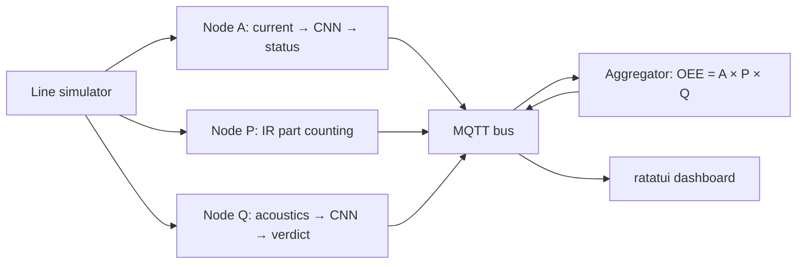

# OEE Bench on TinyML: Digital Twin

Russian version: [README.ru.md](README.ru.md)

A digital twin of a production line: instead of a machine — a deterministic
simulator, instead of microcontrollers — host-side nodes. The nodes read the
signal, recognize the machine mode with a neural network (a
[microflow-rs](./fork/microflow) fork with `Conv1D`), and fold the result
into a single OEE number — overall equipment effectiveness. In parallel,
preparation for a shakedown on a real ESP32-S3 bench is underway
(`firmware/`).

## Glossary

| Term            | Meaning                                                                |
| --------------- | ---------------------------------------------------------------------- |
| OEE             | Availability × Performance × Quality — a single efficiency number      |
| Nodes A / P / Q | Measurers: current (A), part counting (P), acoustics (Q)               |
| Ground truth    | True modes from the scenario — the reference for checking measurements |
| Spike           | A short exploratory study (week 1)                                     |
| Gate            | A "minimum done" checklist at the end of a week                        |
| Hardware track  | The parallel development line for the real bench                       |

## How it works

Target layout (weeks 4–5): the simulator produces a data stream, three nodes
measure their component and publish statuses to MQTT (`oee/line1/*`), the
aggregator folds everything into OEE, a TUI dashboard shows live numbers.



## Structure

| Path              | Purpose                                                                      |
| ----------------- | ---------------------------------------------------------------------------- |
| `line-simulator/` | Machine FSM + current-signal synthesis + CSV (dataset and ground truth)      |
| `nodes/`          | Nodes A (current) / P (counting) / Q (acoustics) — in progress, weeks 4–5    |
| `oee-aggregator/` | A × P × Q → OEE — in progress, week 5                                        |
| `oee-dashboard/`  | ratatui TUI dashboard: live OEE/A/P/Q — in progress, week 5                  |
| `features-cli/`   | Shared Rust feature code + hardware contracts (window, calibration, capture) |
| `fork/microflow`  | microflow-rs engine fork (Conv1D) — its own workspace                        |
| `ml/`             | ML pipeline: the Rust track (`exporter` + `trainer`) + legacy Python scripts |
| `scenarios/`      | Declarative TOML run scenarios (ground truth)                                |
| `spike/`          | Week-1 spike docs (Conv1D serialization)                                     |
| `firmware/`       | ESP32-S3 firmware skeletons — hardware track (its own workspace)             |

Documentation: `docs/eng/` (English), `docs/rus/` (Russian originals).

## Build and tests

```bash
cargo build && cargo test && cargo clippy --all-targets -- -D warnings
```

A separate track is `firmware/`: its own workspace (not part of the root
one); the firmware skeletons build and test on the host without the esp
toolchain:

```bash
cd firmware && cargo test
```

The nalgebra git patch is applied in the root `Cargo.toml` (required since
week 3, when workspace crates gained a path dependency on the fork). CI
(GitHub Actions, `.github/workflows/ci.yml`) runs the same checks: two jobs —
workspace and fork (fmt + clippy + tests + the `sine`/`dense_spike` examples).

## Simulator

```bash
cargo run -p line-simulator -- --scenario scenarios/base.toml --seed 42 --out run1.csv
```

Output: CSV `t_ms,current_a,state` (state is the true mode, ground truth).
Determinism: one seed → a bit-identical CSV (the `deterministic_csv` test).
Scenarios: `base.toml` (normal), `downtime.toml` (downtime),
`degradation.toml` (degradation) — dataset seed material for weeks 3–4.
Signal shape (harmonics, amplitude drift) and noise are scenario parameters
(the `[signal]` and `[noise]` sections). The `--dataset` mode emits labeled
windows (`label,state,x000..x127`) for ML training — the pipeline input.

## ML pipeline

The main path is the Rust track (see [`ml/README.md`](ml/README.md)):
one command does burn training → own PTQ → own flatbuffers writer →
int8 `.tflite`; a re-run is bit-identical. Node A runs the rust-born model
(`ml/models/model_a.tflite`).

```bash
cargo run -p trainer --release --bin train -- \
    --datasets tmp/ds_*.csv --calib 256 --out ml/models/model_a.tflite
```

The first `trainer` build fetches `burn` from crates.io (pinned 0.21.0);
`exporter` builds fully offline.

The Python scripts (`ml/scripts/`) are the legacy path: they produced the
serialization facts F1–F7 (`fork/docs/conv1d-spec.md`) and stay as the
reference for the TF converter's behavior. TensorFlow needs Python 3.12
(the system 3.14 is not supported by TF); the environment lives in `tmp/`
(gitignored):

```bash
tmp/venv312/bin/python ml/scripts/build_conv1d_model.py   # spike model + dump
tmp/venv312/bin/python ml/scripts/build_dense_model.py    # dense bonus
```

## microflow fork

`fork/microflow` is a clone of https://github.com/matteocarnelos/microflow-rs
(commit `6d193da`). Build and tests:

```bash
cd fork/microflow && cargo test
cargo run --example sine        # predict() on the host
cargo run --example dense_spike # our Keras model via #[model]
```

Documents: `fork/NOTES.md` (structure), `fork/docs/conv1d-spec.md` (the
Conv1D spec — the week 2–3 contract).

The fork is wired in as a git submodule: its history is needed for a future
upstream PR. The `fork/microflow` path does not change — path dependencies
are unaffected.

## Hardware track (parallel)

The main development line (without hardware) is the critical path; the bench
shakedown runs in parallel through fixed contracts:

- `features-cli` — a `#![no_std]` contracts crate: `window_spec` (per-node
  window and rate), `calibration` (ADC → amps, ACS712 + divider), `capture`
  (capture CSV schema with `node`/`run_id`);
- `nodes::source` — the `SensorSource` trait: `SimSource` (week 4) and
  firmware sensor sources — one contract;
- `firmware/` — a separate workspace (precedent: `fork/microflow`): `board`
  with the bench pins + A/Q/P firmware skeletons, builds on the host without
  the esp toolchain.

## Status

Done: weeks 1–3 (the Conv1D kernel, the macro parser + codegen, the ML
pipeline) and the rust-ml stretch track (the whole train → PTQ → export
cycle in Rust) — the checklists and artifacts are in the gate docs:
[`week1-gate.md`](./docs/eng/week1-gate.md),
[`week2-gate.md`](./docs/eng/week2-gate.md),
[`week3-gate.md`](./docs/eng/week3-gate.md),
[`rust-ml-gate.md`](./docs/eng/rust-ml-gate.md).

Next: nodes and MQTT (weeks 4–5), QEMU LM3S6965 with criterion
benchmarks (week 6) — the full plan is in
[`docs/eng/plan.md`](./docs/eng/plan.md) (Russian original:
[`docs/rus/plan.md`](./docs/rus/plan.md)).
