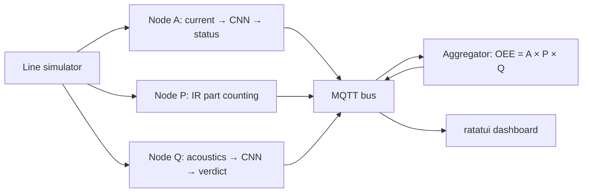
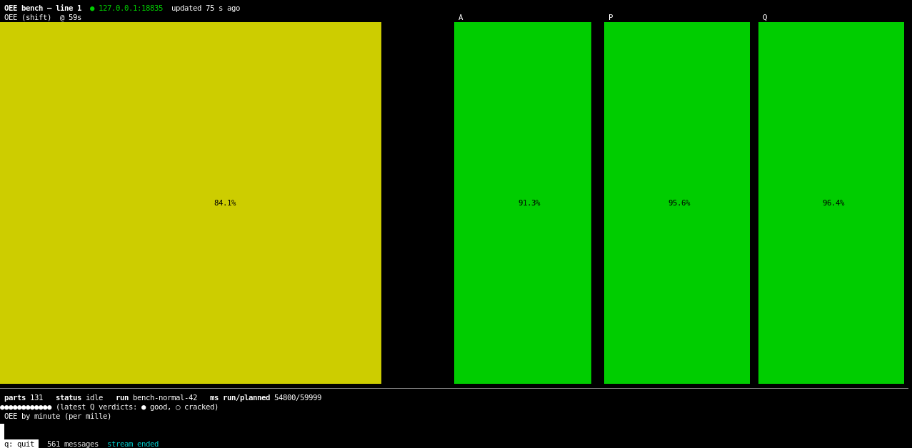

# OEE Bench on TinyML: Digital Twin

Russian version: [README.ru.md](README.ru.md)

A digital twin of a production line: instead of a machine — a deterministic
simulator, instead of microcontrollers — host-side nodes. The nodes read the
signal, recognize the machine mode with a neural network (a
[microflow-rs](./fork/microflow) fork with `Conv1D`), and fold the result
into a single OEE number — overall equipment effectiveness. In parallel,
preparation for a shakedown on a real ESP32-S3 bench is underway
(`firmware/`).

## Glossary

| Term            | Meaning                                                                |
| --------------- | ---------------------------------------------------------------------- |
| OEE             | Availability × Performance × Quality — a single efficiency number      |
| Nodes A / P / Q | Measurers: current (A), part counting (P), acoustics (Q)               |
| Ground truth    | True modes from the scenario — the reference for checking measurements |
| Spike           | A short exploratory study (week 1)                                     |
| Gate            | A "minimum done" checklist at the end of a week                        |
| Hardware track  | The parallel development line for the real bench                       |

## How it works

Target layout (weeks 4–5): the simulator produces a data stream, three nodes
measure their component and publish statuses to MQTT (`oee/line1/*`), the
aggregator folds everything into OEE, a TUI dashboard shows live numbers.



## Structure

| Path              | Purpose                                                                                              |
| ----------------- | ---------------------------------------------------------------------------------------------------- |
| `line-simulator/` | Machine FSM + current-signal synthesis + the belt and tap channels + CSV (dataset and ground truth)  |
| `nodes/`          | Nodes A (current) / P (counting) / Q (acoustics): source → model/edge-detector → MQTT                |
| `oee-aggregator/` | A × P × Q over event-time windows → `oee/line1/oee` + the windows CSV (week 5)                       |
| `oee-dashboard/`  | ratatui TUI dashboard: live OEE/A/P/Q, counter, verdicts (week 5)                                    |
| `features-cli/`   | Shared Rust feature code + hardware contracts (window, calibration, capture)                         |
| `mqtt-min/`       | A minimal own MQTT 3.1.1 client + a loopback/bench broker (publish + subscribe, QoS 0)               |
| `fork/microflow`  | microflow-rs engine fork (Conv1D) — its own workspace                                                |
| `qemu/`           | The LM3S6965 firmware (node A on QEMU) — week 6, its own package                                     |
| `ml/`             | ML pipeline: the Rust track (`exporter` + `trainer`) + legacy Python scripts                         |
| `scenarios/`      | Declarative TOML run scenarios (ground truth), incl. `week5/` — the experiment set                   |
| `scripts/`        | One-command launches: `bench.sh`, `qemu.sh`, `qemu-parity.sh`, `footprint.sh`, `gen-qemu-windows.py` |
| `spike/`          | Week-1 spike docs (Conv1D serialization)                                                             |
| `firmware/`       | ESP32-S3 firmware skeletons — hardware track (its own workspace)                                     |

Documentation: `docs/eng/` (English), `docs/rus/` (Russian originals).

## Build and tests

```bash
cargo build && cargo test && cargo clippy --all-targets -- -D warnings
```

A separate track is `firmware/`: its own workspace (not part of the root
one); the firmware skeletons build and test on the host without the esp
toolchain:

```bash
cd firmware && cargo test
```

The nalgebra git patch is applied in the root `Cargo.toml` (required since
week 3, when workspace crates gained a path dependency on the fork). CI
(GitHub Actions, `.github/workflows/ci.yml`) runs the same checks: two jobs —
workspace and fork (fmt + clippy + tests + the `sine`/`dense_spike` examples).

## Bench: the whole line in one command

```bash
scripts/bench.sh [scenario] [seed] [port]     # default: scenarios/week5/normal.toml 42
```

The script starts the bench MQTT broker (`mqtt-min --bin broker` — no
mosquitto needed; a real one works too), generates the simulator streams
(current CSV + taps dataset + IR-barrier events), and then replays them
through the three nodes (`oee/line1/{a/status, p/count, q/verdict}`) in the
background while the ratatui dashboard runs in the foreground — the gauges
fill live during the replay and freeze on the final window; `oee/line1/oee`
+ `tmp/bench/oee_windows.csv` carry the aggregated `OEE = A × P × Q`. The
aggregator subscribes before the nodes publish — QoS 0 does not replay the
past, and neither does the broker (no retention: that is why the dashboard
starts before the replay, not after) — and exits after every node has
publishes its `oee/line1/{node}/end` stream marker. Artifacts land in
`tmp/bench/` (a custom port gets `tmp/bench-<port>` — concurrent runs do
not share them); `RELEASE=1` switches the whole bench to release builds
for big scenarios.



*The dashboard at the end of the bench run (the `normal` scenario, seed 42:
OEE 84.1%).*

## Simulator
## QEMU (LM3S6965): the MCU without an MCU

Week 6: node A's model compiled into a `no_std` Cortex-M3 firmware for the
emulated LM3S6965 eval board — portability and footprint, with
host/QEMU parity as the gate. One-time setup: `rustup target add
thumbv7m-none-eabi`, `cargo install flip-link`, and either a native
`qemu-system-arm` or the docker fallback (`docker build -t oee-qemu qemu/`;
`scripts/qemu.sh` picks the native binary when present). Then:

```bash
scripts/qemu-parity.sh     # firmware vs host: PARITY OK, bit-for-bit
scripts/footprint.sh       # flash/RAM: conv1d vs the conv2d trick vs dense
(cd qemu && cargo run --release --bin oee-qemu)   # the UART demo itself
```

The firmware crate is [`qemu/`](qemu/README.md) (not a workspace member);
the engine benchmarks live in the fork
(`cargo bench --bench conv1d`, see `fork/NOTES.md` week 6). Details and the
numbers — [`docs/eng/report.md`](docs/eng/report.md) and
[`docs/eng/week6-gate.md`](docs/eng/week6-gate.md).

## Simulator

```bash
cargo run -p line-simulator -- --scenario scenarios/base.toml --seed 42 --out run1.csv
```

Output: CSV `t_ms,current_a,state` (state is the true mode, ground truth).
Determinism: one seed → a bit-identical CSV (the `deterministic_csv` test).
Scenarios: `base.toml` (normal), `downtime.toml` (downtime),
`degradation.toml` (degradation), `jam_cycle.toml` (jam-heavy, week 3),
`taps.toml` (the tap channel, week 4), and `week5/{normal,downtime,
slowdown,rejects}.toml` (the measured-vs-truth experiment set, week 5).
Signal shape (harmonics, amplitude
drift) and noise are scenario parameters (the `[signal]` and `[noise]`
sections). The `--dataset` mode emits labeled current windows
(`label,state,x000..x127`) — the model A training input; the
`--taps-dataset` mode (+ `--taps-meta`) emits tap-test windows, 1024 @
16 kHz (`label,state,x000..x1023` + the `t_ms,verdict` meta, the `[taps]`
section) — the model Q dataset; the `--belt-events` mode (+ `--belt-meta`)
emits the IR-barrier level stream (`t_ms,ir`) plus the part truth
(`t_ms,pulses`, the `[belt]` section) — node P's input. The three channels
are independent seeded streams: requesting one changes neither of the
others. `soak.toml` stretches the same densities to 3 h of simulated
time — the message-load scenario (~100 000 messages on `oee/line1/#`),
and `soak-1m.toml` reaches ~1 072 500 messages in 12 h with 150 ms
belt/tap periods (run both as `RELEASE=1 scripts/bench.sh <scenario> 42`:
the debug default crawls on the multi-GB CSVs — 184 s vs 6 s for node A;
see [`docs/eng/soak.md`](docs/eng/soak.md) for both launch variants, the
measured numbers, and the 30-hour carrier-precision wall).

## ML pipeline

The main path is the Rust track (see [`ml/README.md`](ml/README.md)):
one command does burn training → own PTQ → own flatbuffers writer →
int8 `.tflite`; a re-run is bit-identical. Node A runs the rust-born model
(`ml/models/model_a.tflite`), node Q — `ml/models/model_q.tflite` (the same
pipeline with `--task q`; the datasets come from the simulator's tap
channel).

```bash
cargo run -p trainer --release --bin train -- \
    --datasets tmp/ds_*.csv --calib 256 --out ml/models/model_a.tflite
```

The first `trainer` build fetches `burn` from crates.io (pinned 0.21.0);
`exporter` builds fully offline.

The Python scripts (`ml/scripts/`) are the legacy path: they produced the
serialization facts F1–F7 (`fork/docs/conv1d-spec.md`) and stay as the
reference for the TF converter's behavior. TensorFlow needs Python 3.12
(the system 3.14 is not supported by TF); the environment lives in `tmp/`
(gitignored):

```bash
tmp/venv312/bin/python ml/scripts/build_conv1d_model.py   # spike model + dump
tmp/venv312/bin/python ml/scripts/build_dense_model.py    # dense bonus
```

## microflow fork

`fork/microflow` is a clone of https://github.com/matteocarnelos/microflow-rs
(commit `eda0ef6`, main after the week-3 merge). Build and tests:

```bash
cd fork/microflow && cargo test
cargo run --example sine        # predict() on the host
cargo run --example dense_spike # our Keras model via #[model]
```

Documents: `fork/NOTES.md` (structure), `fork/docs/conv1d-spec.md` (the
Conv1D spec — the week 2–3 contract).

The fork is wired in as a git submodule: its history is needed for a future
upstream PR. The `fork/microflow` path does not change — path dependencies
are unaffected.

## Hardware track (parallel)

The main development line (without hardware) is the critical path; the bench
shakedown runs in parallel through fixed contracts:

- `features-cli` — a `#![no_std]` contracts crate: `window_spec` (per-node
  window and rate), `calibration` (ADC → amps, ACS712 + divider), `capture`
  (capture CSV schema with `node`/`run_id`);
- `nodes::source` — the `SensorSource` trait: `SimSource` (week 4) and
  firmware sensor sources — one contract;
- `firmware/` — a separate workspace (precedent: `fork/microflow`): `board`
  with the bench pins + A/Q/P firmware skeletons, builds on the host without
  the esp toolchain. The shakedown decomposition —
  [`docs/eng/decompose/firmware.md`](./docs/eng/decompose/firmware.md).

The bench is bought (2026-08-20): 2× ESP32-S3-DevKitC-1 (N16R8) — nodes A
and Q; 1× ESP32-S3-WROOM-1 N16R8 CAM with OV2640 — node P + the stretch
camera (the purchase list —
[`docs/eng/equipment.md`](./docs/eng/equipment.md)).

The bench's first flash — 2026-09-14, node A (`firmware-a`, a DevKitC-1
clone with a CH343 bridge): S0 passed → espflash wrote the 2nd-stage
bootloader, the partition table and the app in one image; the node booted
and calibrated its zero. Log:

```text
espflash flash --monitor --port /dev/ttyACM0 target/xtensa-esp32s3-none-elf/release/firmware-a
[2026-09-14T03:17:32Z INFO ] Serial port: '/dev/ttyACM0'
[2026-09-14T03:17:32Z INFO ] Connecting...
[2026-09-14T03:17:32Z INFO ] Using flash stub
Chip type:         esp32s3 (revision v0.2)
Crystal frequency: 40 MHz
Flash size:        16MB
Features:          WiFi, BLE, Embedded Flash
MAC address:       44:1b:f6:fd:ea:cc
App/part. size:    109,856/16,384,000 bytes, 0.67%
[00:00:01] [========================================]       1/1       0x0      Verifying... OK!
[00:00:00] [========================================]       1/1       0x8000   Verifying... OK!
[00:00:03] [========================================]       3/3       0x10000  Verifying... OK!
[2026-09-14T03:17:39Z INFO ] Flashing has completed!
Commands:
    CTRL+R    Reset chip
    CTRL+C    Exit

ESP-ROM:esp32s3-20210327
Build:Mar 27 2021
rst:0x1 (POWERON),boot:0x8 (SPI_FAST_FLASH_BOOT)
SPIWP:0xee
mode:DIO, clock div:2
load:0x3fce2820,len:0x14d0
load:0x403c8700,len:0xdcc
load:0x403cb700,len:0x2f54
entry 0x403c8900
I (29) boot: ESP-IDF v6.1-beta1-497-g14f663f003e 2nd stage bootloader
I (30) boot: Multicore bootloader
I (30) boot: chip revision: v0.2
I (30) boot: efuse block revision: v1.4
I (34) boot.esp32s3: Boot SPI Speed : 40MHz
I (38) boot.esp32s3: SPI Mode       : DIO
I (42) boot.esp32s3: SPI Flash Size : 16MB
I (45) boot: Enabling RNG early entropy source...
I (50) boot: Partition Table:
I (52) boot: ## Label            Usage          Type ST Offset   Length
I (59) boot:  0 nvs              WiFi data        01 02 00009000 00006000
I (65) boot:  1 phy_init         RF data          01 01 0000f000 00001000
I (72) boot:  2 factory          factory app      00 00 00010000 00fa0000
I (78) boot: End of partition table
I (82) esp_image: segment 0: paddr=00010020 vaddr=3c000020 size=02990h ( 10640) map
I (92) esp_image: segment 1: paddr=000129b8 vaddr=3fc89998 size=009c4h ( 2500) load
I (97) esp_image: segment 2: paddr=00013384 vaddr=40378000 size=01998h ( 6552) load
I (106) esp_image: segment 3: paddr=00014d24 vaddr=00000000 size=0b2f4h (45812)
I (123) esp_image: segment 4: paddr=00020020 vaddr=42010020 size=0acd4h (44244) map
I (135) boot: Loaded app from partition at offset 0x10000
I (135) boot: Disabling RNG early entropy source...
a: boot, run_id=bench-a
a: zero=2229
a,bench-a,160,idle
```

The shakedown facts — [`firmware/NOTES.md`](./firmware/NOTES.md).

## Status

Done: weeks 1–6 — the Conv1D kernel (optimized in week 6: zero-point
hoisting, bit-exact, 1.67–1.73× over the reshape trick on the node models),
the macro parser + codegen, the ML pipeline, nodes A and Q end-to-end with
MQTT publishing, node P with the belt channel, the OEE aggregator with
event-time windows, the ratatui dashboard, the measured-vs-truth experiment
(the table below), the rust-ml stretch track, the QEMU LM3S6965 firmware
with host parity and the footprint table, and the report — the checklists
and artifacts are in the gate docs:
[`week1-gate.md`](./docs/eng/week1-gate.md),
[`week2-gate.md`](./docs/eng/week2-gate.md),
[`week3-gate.md`](./docs/eng/week3-gate.md),
[`rust-ml-gate.md`](./docs/eng/rust-ml-gate.md),
[`week4-gate.md`](./docs/eng/week4-gate.md),
[`week5-gate.md`](./docs/eng/week5-gate.md),
[`week6-gate.md`](./docs/eng/week6-gate.md); the report —
[`docs/eng/report.md`](./docs/eng/report.md), the demo scenario —
[`docs/eng/demo.md`](./docs/eng/demo.md) with its recording
[`docs/media/OEE-demo.mp4`](./docs/media/OEE-demo.mp4), and a recorded run
of the 1M bench — [`docs/media/OEE-bench-1m.mp4`](./docs/media/OEE-bench-1m.mp4)
(the dashboard winding up to ~1.07M messages).

The week-5 main result — measured vs true OEE (the full experiment:
`cargo test -p oee-aggregator --test experiment -- --nocapture`):

| scenario | seed | true OEE | measured | err    |
| -------- | ---- | -------- | -------- | ------ |
| normal   | 42   | 0.841    | 0.841    | +0.000 |
| downtime | 42   | 0.516    | 0.516    | +0.000 |
| slowdown | 42   | 0.612    | 0.612    | +0.000 |
| rejects  | 42   | 0.478    | 0.478    | +0.000 |

The zero error is the construction working: the belt count is exact by
(design, the A boundary lags cancel, and the models are in-distribution —
distribution shift and resolution limits are quantified in the sensitivity
tables of [`week5-gate.md`](./docs/eng/week5-gate.md).

Next: QEMU LM3S6965 with criterion benchmarks, the report and the demo
(week 6) — the full plan is in
[`docs/eng/plan.md`](./docs/eng/plan.md) (Russian original:
[`docs/rus/plan.md`](./docs/rus/plan.md)).
