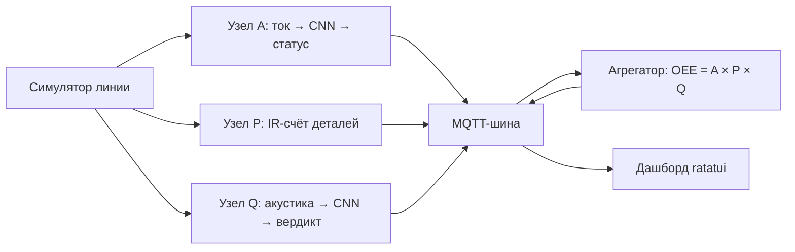

# OEE-стенд на TinyML: цифровой двойник

Английская версия: [README.md](README.md).

Цифровой двойник производственной линии: вместо станка — детерминированный
симулятор, вместо микроконтроллеров — узлы на хосте. Узлы читают сигнал,
распознают режим работы нейросетью (форк [microflow-rs](./fork/microflow) с
`Conv1D`) и сводят результат в одну цифру OEE — общую эффективность
оборудования. Параллельно идёт подготовка к обкатке на реальном стенде
ESP32-S3 (`firmware/`).

## Словарь

| Термин         | Значение                                                        |
| -------------- | --------------------------------------------------------------- |
| OEE            | Availability × Performance × Quality — одна цифра эффективности |
| Узлы A / P / Q | Измерители: ток (A), счёт деталей (P), акустика (Q)             |
| Ground truth   | Истинные режимы из сценария — эталон для сверки измерений       |
| Спайк          | Короткое пробное исследование (неделя 1)                        |
| Гейт           | Чеклист «минимально готово» в конце недели                      |
| Колея железа   | Параллельная линия разработки под реальный стенд                |

## Как это устроено

Целевая схема (недели 4–5): симулятор порождает поток данных, три узла
измеряют свою компоненту и публикуют статусы в MQTT (`oee/line1/*`),
агрегатор сводит всё в OEE, TUI-дашборд показывает live-цифры.



## Структура

| Путь              | Назначение                                                                                             |
| ----------------- | ------------------------------------------------------------------------------------------------------ |
| `line-simulator/` | FSM станка + синтез сигнала тока + каналы ленты и тапов + CSV (датасет и ground truth)                 |
| `nodes/`          | Узлы A (ток) / P (счёт) / Q (акустика): источник → модель/детектор фронта → MQTT                       |
| `oee-aggregator/` | A × P × Q по окнам машинного времени → `oee/line1/oee` + windows-CSV (неделя 5)                        |
| `oee-dashboard/`  | TUI-дашборд ratatui: live OEE/A/P/Q, счётчик, вердикты (неделя 5)                                      |
| `features-cli/`   | Общий Rust-код фич + контракты железа (окно, калибровка, capture)                                      |
| `mqtt-min/`       | Минимальный собственный MQTT 3.1.1-клиент + loopback/стенд-брокер (публикация и подписка, QoS 0)       |
| `fork/microflow`  | Форк движка microflow-rs (Conv1D) — свой workspace                                                     |
| `qemu/`           | Прошивка под LM3S6965 (узел A в QEMU) — неделя 6, свой пакет                                           |
| `ml/`             | ML-конвейер: Rust-трек (`exporter` + `trainer`) + legacy-скрипты Python                                |
| `scenarios/`      | Декларативные TOML-сценарии прогонов (ground truth), вкл. `week5/` — набор эксперимента                |
| `scripts/`        | Запуски одной командой: `bench.sh`, `qemu.sh`, `qemu-parity.sh`, `footprint.sh`, `gen-qemu-windows.py` |
| `spike/`          | Спайк-доки недели 1 (сериализация Conv1D)                                                              |
| `firmware/`       | Скелет прошивок ESP32-S3 — колея железа (свой workspace)                                               |

## Сборка и тесты

```bash
cargo build && cargo test && cargo clippy --all-targets -- -D warnings
```

Отдельная колея — `firmware/`: свой workspace (в корневой не входит); скелет
прошивок собирается и тестируется на хосте без esp-тулчейна:

```bash
cd firmware && cargo test
```

Патч nalgebra из git применяется в корневом `Cargo.toml` (нужен с недели 3,
когда крейты workspace получили path-зависимость от форка). CI (GitHub
Actions, `.github/workflows/ci.yml`) выполняет те же проверки: два задания —
workspace и форк (fmt + clippy + тесты + примеры `sine`/`dense_spike`).

## Стенд: вся линия одной командой

```bash
scripts/bench.sh [сценарий] [seed] [порт]     # дефолт: scenarios/week5/normal.toml 42
```

Скрипт поднимает стендовый MQTT-брокер (`mqtt-min --bin broker` — mosquitto
не нужен; настоящий тоже подойдёт), генерирует потоки симулятора (CSV тока
+ датасет тапов + события ИК-барьера) и затем проигрывает их через три узла
(`oee/line1/{a/status, p/count, q/verdict}`) в фоне, пока в переднем плане
работает ratatui-дашборд — гейджи наполняются живьём во время повтора и
замирают на финальном окне; агрегированный `OEE = A × P × Q` идёт в
`oee/line1/oee` + `tmp/bench/oee_windows.csv`. Агрегатор подписывается до
публикации узлов — QoS 0 не воспроизводит прошлое, и брокер тоже (без
ретенций: поэтому дашборд стартует ДО повторa, а не после) — и завершается,
когда каждый узел опубликует маркер конца потока `oee/line1/{node}/end`.
Артефакты — в `tmp/bench/` (кастомный порт получает `tmp/bench-<port>` —
параллельные запуски не делят их); `RELEASE=1` переводит весь стенд на
release-сборку для больших сценариев.


*Дашборд по завершении прогона стенда (сценарий `normal`, сид 42:
OEE 84.1%).*

## QEMU (LM3S6965): MCU без MCU

Неделя 6: модель узла A, скомпилированная в `no_std`-прошивку под
эмулируемую отладочную плату LM3S6965 (Cortex-M3) — портабельность и
footprint, гейт — паритет хост/QEMU. Первичная настройка: `rustup target
add thumbv7m-none-eabi`, `cargo install flip-link` и либо нативный
`qemu-system-arm`, либо docker-запас (`docker build -t oee-qemu qemu/`;
`scripts/qemu.sh` сам выбирает нативный, если он есть). Дальше:

```bash
scripts/qemu-parity.sh     # прошивка против хоста: PARITY OK, бит-в-бит
scripts/footprint.sh       # flash/RAM: conv1d против трюка conv2d против dense
(cd qemu && cargo run --release --bin oee-qemu)   # само демо через UART
```

Крейт прошивки — [`qemu/`](qemu/README.ru.md) (не член воркспейса);
бенчмарки движка живут в форке (`cargo bench --bench conv1d`, см.
`fork/NOTES.md`, неделя 6). Подробности и числа —
[`docs/rus/report.md`](docs/rus/report.md) и
[`docs/rus/week6-gate.md`](docs/rus/week6-gate.md).

## Симулятор

```bash
cargo run -p line-simulator -- --scenario scenarios/base.toml --seed 42 --out run1.csv
```

Выход: CSV `t_ms,current_a,state` (state — истинный режим, ground truth).
Детерминизм: один seed → побитово одинаковый CSV (тест `deterministic_csv`).
Сценарии: `base.toml` (норма), `downtime.toml` (простои), `degradation.toml`
(деградация), `jam_cycle.toml` (jam-тяжёлый, неделя 3), `taps.toml`
(тап-канал, неделя 4) и `week5/{normal,downtime,slowdown,rejects}.toml`
(набор эксперимента «измеренное против истинного», неделя 5). Форма
сигнала (гармоники, дрейф амплитуды) и шум —
параметры сценария (секции `[signal]` и `[noise]`). Режим `--dataset` выдаёт
размеченные окна тока (`label,state,x000..x127`) — вход обучения модели A;
режим `--taps-dataset` (+ `--taps-meta`) — окна тап-теста 1024 @ 16 кГц
(`label,state,x000..x1023` + мета `t_ms,verdict`, секка `[taps]`) — датасет
модели Q; режим `--belt-events` (+ `--belt-meta`) — поток уровней
ИК-барьера (`t_ms,ir`) плюс truth деталей (`t_ms,pulses`, секция `[belt]`)
— вход узла P. Три канала — независимые засеянные потоки: запрос одного
не меняет остальные. `soak.toml` растягивает те же плотности до 3 часов
симулированного времени — сценарий под нагрузку сообщениями (~100 000
сообщений на `oee/line1/#`), а `soak-1m.toml` добирает ~1 072 500
сообщений за 12 часов с периодами ленты/тапов 150 мс (оба —
`RELEASE=1 scripts/bench.sh <сценарий> 42`: debug-дефолт на мультигигабайтных
CSV ползёт — 184 с против 6 с у узла A; детали, измеренные числа и «стена
30 часов» — в [`docs/rus/soak.md`](docs/rus/soak.md)).

## ML-конвейер

Основной путь — Rust-трек (см. [`ml/README.md`](ml/README.md)): одной
командой burn-обучение → собственный PTQ → собственный flatbuffers-райтер →
int8 `.tflite`; повторный запуск побитово совпадает. Узел A работает на
rust-born модели (`ml/models/model_a.tflite`), узел Q — на
`ml/models/model_q.tflite` (тот же пайплайн с флагом `--task q`; датасеты —
тап-канал симулятора).

```bash
cargo run -p trainer --release --bin train -- \
    --datasets tmp/ds_*.csv --calib 256 --out ml/models/model_a.tflite
```

Первая сборка `trainer` скачивает `burn` с crates.io (запинован 0.21.0);
`exporter` собирается полностью офлайн.

Python-скрипты (`ml/scripts/`) — legacy-путь: они дали факты сериализации
F1–F7 (`fork/docs/conv1d-spec.md`) и остаются справкой по поведению
TF-конвертера. TensorFlow нужен Python 3.12 (системный 3.14 не поддерживается
TF); окружение живёт в `tmp/` (gitignored):

```bash
tmp/venv312/bin/python ml/scripts/build_conv1d_model.py   # спайк-модель + дамп
tmp/venv312/bin/python ml/scripts/build_dense_model.py    # dense-бонус
```

## Форк microflow

`fork/microflow` — клон https://github.com/matteocarnelos/microflow-rs
(коммит `eda0ef6`, main после вливания недели 3). Сборка и тесты:

```bash
cd fork/microflow && cargo test
cargo run --example sine        # predict() на хосте
cargo run --example dense_spike # наша Keras-модель через #[model]
```

Документы: `fork/NOTES.md` (структура), `fork/docs/conv1d-spec.md` (спека
Conv1D — контракт недель 2–3).

Форк подключён как git submodule: история нужна для будущего PR в апстрим.
Путь `fork/microflow` не меняется — path-зависимости не затронуты.

## Колея железа (параллельная)

Основная линия разработки (без железа) — критический путь; обкатка на стенде
идёт параллельно через фиксированные контракты:

- `features-cli` — `#![no_std]`-крейт контрактов: `window_spec` (окно и
  частота per-узел), `calibration` (ADC → амперы, ACS712 + делитель),
  `capture` (CSV-схема захватов с `node`/`run_id`);
- `nodes::source` — trait `SensorSource`: `SimSource` (неделя 4) и
  сенсорные источники прошивки — один контракт;
- `firmware/` — отдельный workspace (прецедент `fork/microflow`):
  `board` с пинами стенда + заглушки прошивок A/Q/P, собирается на хосте
  без esp-тулчейна.

Стенд закуплен (2026-08-20): 2× ESP32-S3-DevKitC-1 (N16R8) — узлы A и Q;
1× ESP32-S3-WROOM-1 N16R8 CAM с OV2640 — узел P + stretch-камера (закупка —
[`docs/rus/equipment.md`](./docs/rus/equipment.md)). Декомпозиция обкатки —
[`docs/rus/decompose/firmware.md`](./docs/rus/decompose/firmware.md).

Первая прошивка на стенде — 2026-09-14, узел A (`firmware-a`, клон DevKitC-1
с мостом CH343): этап S0 пройден → espflash залил вторичный загрузчик,
таблицу разделов и приложение одним образом, узел поднялся и откалибровал
нуль. Журнал:

```text
espflash flash --monitor --port /dev/ttyACM0 target/xtensa-esp32s3-none-elf/release/firmware-a
[2026-09-14T03:17:32Z INFO ] Serial port: '/dev/ttyACM0'
[2026-09-14T03:17:32Z INFO ] Connecting...
[2026-09-14T03:17:32Z INFO ] Using flash stub
Chip type:         esp32s3 (revision v0.2)
Crystal frequency: 40 MHz
Flash size:        16MB
Features:          WiFi, BLE, Embedded Flash
MAC address:       44:1b:f6:fd:ea:cc
App/part. size:    109,856/16,384,000 bytes, 0.67%
[00:00:01] [========================================]       1/1       0x0      Verifying... OK!
[00:00:00] [========================================]       1/1       0x8000   Verifying... OK!
[00:00:03] [========================================]       3/3       0x10000  Verifying... OK!
[2026-09-14T03:17:39Z INFO ] Flashing has completed!
Commands:
    CTRL+R    Reset chip
    CTRL+C    Exit

ESP-ROM:esp32s3-20210327
Build:Mar 27 2021
rst:0x1 (POWERON),boot:0x8 (SPI_FAST_FLASH_BOOT)
SPIWP:0xee
mode:DIO, clock div:2
load:0x3fce2820,len:0x14d0
load:0x403c8700,len:0xdcc
load:0x403cb700,len:0x2f54
entry 0x403c8900
I (29) boot: ESP-IDF v6.1-beta1-497-g14f663f003e 2nd stage bootloader
I (30) boot: Multicore bootloader
I (30) boot: chip revision: v0.2
I (30) boot: efuse block revision: v1.4
I (34) boot.esp32s3: Boot SPI Speed : 40MHz
I (38) boot.esp32s3: SPI Mode       : DIO
I (42) boot.esp32s3: SPI Flash Size : 16MB
I (45) boot: Enabling RNG early entropy source...
I (50) boot: Partition Table:
I (52) boot: ## Label            Usage          Type ST Offset   Length
I (59) boot:  0 nvs              WiFi data        01 02 00009000 00006000
I (65) boot:  1 phy_init         RF data          01 01 0000f000 00001000
I (72) boot:  2 factory          factory app      00 00 00010000 00fa0000
I (78) boot: End of partition table
I (82) esp_image: segment 0: paddr=00010020 vaddr=3c000020 size=02990h ( 10640) map
I (92) esp_image: segment 1: paddr=000129b8 vaddr=3fc89998 size=009c4h ( 2500) load
I (97) esp_image: segment 2: paddr=00013384 vaddr=40378000 size=01998h ( 6552) load
I (106) esp_image: segment 3: paddr=00014d24 vaddr=00000000 size=0b2f4h (45812)
I (123) esp_image: segment 4: paddr=00020020 vaddr=42010020 size=0acd4h (44244) map
I (135) boot: Loaded app from partition at offset 0x10000
I (135) boot: Disabling RNG early entropy source...
a: boot, run_id=bench-a
a: zero=2229
a,bench-a,160,idle
```

Узел Q (DevKitC-1 №2, `firmware-q`) — перепрошит финальной HEAD-сборкой
(после выноса синтетического окна в lib): вердикты `cracked` каждые 400 мс —
закреплённое тестом поведение синтетики до S4 (проверка контура, не метка
качества). Загрузчик и таблица разделов уже во flash — менялось только
приложение (одна область 0x10000). Журнал:

```text
espflash flash --monitor --port /dev/ttyACM0 target/xtensa-esp32s3-none-elf/release/firmware-q
[2026-09-14T05:36:49Z INFO ] Serial port: '/dev/ttyACM0'
[2026-09-14T05:36:49Z INFO ] Connecting...
[2026-09-14T05:36:49Z INFO ] Using flash stub
Chip type:         esp32s3 (revision v0.2)
Crystal frequency: 40 MHz
Flash size:        16MB
Features:          WiFi, BLE, Embedded Flash
MAC address:       44:1b:f6:fd:fa:60
App/part. size:    113,456/16,384,000 bytes, 0.69%
[00:00:04] [========================================]       3/3       0x10000  Verifying... OK!
[2026-09-14T05:36:55Z INFO ] Flashing has completed!
Commands:
    CTRL+R    Reset chip
    CTRL+C    Exit

ESP-ROM:esp32s3-20210327
Build:Mar 27 2021
rst:0x1 (POWERON),boot:0x8 (SPI_FAST_FLASH_BOOT)
SPIWP:0xee
mode:DIO, clock div:2
load:0x3fce2820,len:0x14d0
load:0x403c8700,len:0xdcc
load:0x403cb700,len:0x2f54
entry 0x403c8900
I (29) boot: ESP-IDF v6.1-beta1-497-g14f663f003e 2nd stage bootloader
I (30) boot: Multicore bootloader
I (30) boot: chip revision: v0.2
I (30) boot: efuse block revision: v1.4
I (34) boot.esp32s3: Boot SPI Speed : 40MHz
I (38) boot.esp32s3: SPI Mode       : DIO
I (42) boot.esp32s3: SPI Flash Size : 16MB
I (45) boot: Enabling RNG early entropy source...
I (50) boot: Partition Table:
I (52) boot: ## Label            Usage          Type ST Offset   Length
I (59) boot:  0 nvs              WiFi data        01 02 00009000 00006000
I (65) boot:  1 phy_init         RF data          01 01 0000f000 00001000
I (72) boot:  2 factory          factory app      00 00 00010000 00fa0000
I (78) boot: End of partition table
I (82) esp_image: segment 0: paddr=00010020 vaddr=3c000020 size=04300h ( 17152) map
I (93) esp_image: segment 1: paddr=00014328 vaddr=3fc89998 size=009bch ( 2492) load
I (97) esp_image: segment 2: paddr=00014cec vaddr=40378000 size=01998h ( 6552) load
I (106) esp_image: segment 3: paddr=0001668c vaddr=00000000 size=0998ch ( 39308)
I (123) esp_image: segment 4: paddr=00020020 vaddr=42010020 size=0bae8h ( 47848) map
I (134) boot: Loaded app from partition at offset 0x10000
I (135) boot: Disabling RNG early entropy source...
q: boot, run_id=bench-q
q,bench-q,30,cracked
q,bench-q,430,cracked
q,bench-q,830,cracked
q,bench-q,1230,cracked
q,bench-q,1630,cracked
q,bench-q,2030,cracked
q,bench-q,2430,cracked
q,bench-q,2830,cracked
q,bench-q,3230,cracked
q,bench-q,3630,cracked
q,bench-q,4030,cracked
```

Узел P (CAM-плата, `firmware-p`) — app 99 040 байт, минимальный из трёх
(нет модели); после boot-строки тишина — норма без датчика. Нюанс CAM-платы:
прошивать и мониторить только через мостовой порт (нативный USB-порт не
даёт авто-download). Журнал:

```text
espflash flash --monitor --port /dev/ttyACM0 bin/20260914085743-firmware-p
[2026-09-14T06:09:02Z INFO ] Serial port: '/dev/ttyACM0'
[2026-09-14T06:09:02Z INFO ] Connecting...
[2026-09-14T06:09:02Z INFO ] Using flash stub
Chip type:         esp32s3 (revision v0.2)
Crystal frequency: 40 MHz
Flash size:        16MB
Features:          WiFi, BLE, Embedded Flash
MAC address:       90:70:69:f8:fc:70
App/part. size:    99,040/16,384,000 bytes, 0.60%
[00:00:01] [========================================]       1/1       0x0      Verifying... OK!
[00:00:00] [========================================]       1/1       0x8000   Verifying... OK!
[00:00:03] [========================================]       2/2       0x10000  Verifying... OK!
[2026-09-14T06:09:08Z INFO ] Flashing has completed!
Commands:
    CTRL+R    Reset chip
    CTRL+C    Exit

ESP-ROM:esp32s3-20210327
Build:Mar 27 2021
rst:0x1 (POWERON),boot:0x8 (SPI_FAST_FLASH_BOOT)
SPIWP:0xee
mode:DIO, clock div:2
load:0x3fce2820,len:0x14d0
load:0x403c8700,len:0xdcc
load:0x403cb700,len:0x2f54
entry 0x403c8900
I (29) boot: ESP-IDF v6.1-beta1-497-g14f663f003e 2nd stage bootloader
I (30) boot: Multicore bootloader
I (30) boot: chip revision: v0.2
I (30) boot: efuse block revision: v1.4
I (34) boot.esp32s3: Boot SPI Speed : 40MHz
I (38) boot.esp32s3: SPI Mode       : DIO
I (42) boot.esp32s3: SPI Flash Size : 16MB
I (45) boot: Enabling RNG early entropy source...
I (50) boot: Partition Table:
I (52) boot: ## Label            Usage          Type ST Offset   Length
I (59) boot:  0 nvs              WiFi data        01 02 00009000 00006000
I (65) boot:  1 phy_init         RF data          01 01 0000f000 00001000
I (72) boot:  2 factory          factory app      00 00 00010000 00fa0000
I (78) boot: End of partition table
I (82) esp_image: segment 0: paddr=00010020 vaddr=3c000020 size=01e30h (  7728) map
I (91) esp_image: segment 1: paddr=00011e58 vaddr=3fc89998 size=009b0h ( 2480) load
I (97) esp_image: segment 2: paddr=00012810 vaddr=40378000 size=01998h ( 6552) load
I (106) esp_image: segment 3: paddr=000141b0 vaddr=00000000 size=0be68h ( 48744)
I (123) esp_image: segment 4: paddr=00020020 vaddr=42010020 size=08298h ( 33432) map
I (133) boot: Loaded app from partition at offset 0x10000
I (133) boot: Disabling RNG early entropy source...
p: boot, run_id=bench-p
```

Факты шейкдауна — [`firmware/NOTES.md`](./firmware/NOTES.md).

## Статус

Готово: недели 1–6 — кернел Conv1D (в неделю 6 оптимизирован: вынос
zero-point, бит-точный, 1.67–1.73× против трюка reshape на моделях узлов),
парсер макроса + кодеген, ML-конвейер, узлы A и Q end-to-end с публикацией
MQTT, узел P с каналом ленты, OEE-агрегатор на окнах машинного времени,
ratatui-дашборд, эксперимент «измеренное против истинного» (таблица ниже),
стретч-трек rust-ml, прошивка под QEMU LM3S6965 с паритетом и таблицей
footprint и отчёт — чеклисты и артефакты в гейт-доках:
[`week1-gate.md`](./docs/rus/week1-gate.md),
[`week2-gate.md`](./docs/rus/week2-gate.md),
[`week3-gate.md`](./docs/rus/week3-gate.md),
[`rust-ml-gate.md`](./docs/rus/rust-ml-gate.md),
[`week4-gate.md`](./docs/rus/week4-gate.md),
[`week5-gate.md`](./docs/rus/week5-gate.md),
[`week6-gate.md`](./docs/rus/week6-gate.md); отчёт —
[`docs/rus/report.md`](./docs/rus/report.md), сценарий демо —
[`docs/rus/demo.md`](./docs/rus/demo.md) с записью
[`docs/media/OEE-demo.mp4`](./docs/media/OEE-demo.mp4), а также запись
прогона на миллион сообщений —
[`docs/media/OEE-bench-1m.mp4`](./docs/media/OEE-bench-1m.mp4)
(дашборд наматывает ~1.07 млн сообщений).

Главный результат недели 5 — измеренное против истинного OEE (полный
эксперимент: `cargo test -p oee-aggregator --test experiment -- --nocapture`):

| сценарий | сид | true OEE | measured | err    |
| -------- | --- | -------- | -------- | ------ |
| normal   | 42  | 0,841    | 0,841    | +0,000 |
| downtime | 42  | 0,516    | 0,516    | +0,000 |
| slowdown | 42  | 0,612    | 0,612    | +0,000 |
| rejects  | 42  | 0,478    | 0,478    | +0,000 |

Ноль — работа конструкции: счёт ленты точен по построению, сдвиги границ A
взаимно компенсируются, модели в распределении. Сдвиг распределения и предел
разрешения квантифицированы таблицами чувствительности в
[`week5-gate.md`](./docs/rus/week5-gate.md).

Дальше: QEMU LM3S6965 с бенчмарками criterion, отчёт и демо (неделя 6) —
полный план в
[`docs/rus/plan.md`](./docs/rus/plan.md) (английский перевод —
[`docs/eng/plan.md`](./docs/eng/plan.md)).
