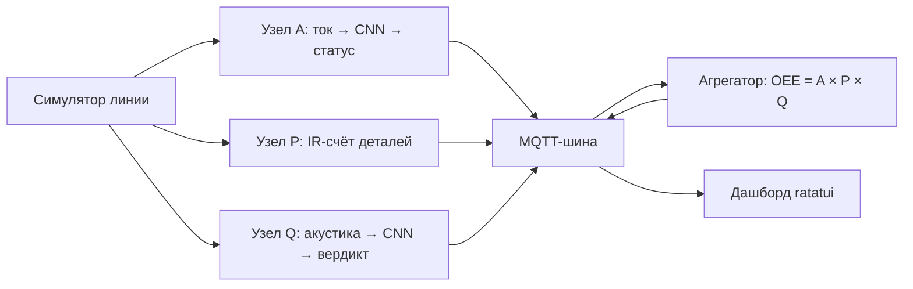

# OEE-стенд на TinyML: цифровой двойник

Английская версия: [README.md](README.md).

Цифровой двойник производственной линии: вместо станка — детерминированный
симулятор, вместо микроконтроллеров — узлы на хосте. Узлы читают сигнал,
распознают режим работы нейросетью (форк [microflow-rs](./fork/microflow) с
`Conv1D`) и сводят результат в одну цифру OEE — общую эффективность
оборудования. Параллельно идёт подготовка к обкатке на реальном стенде
ESP32-S3 (`firmware/`).

## Словарь

| Термин         | Значение                                                        |
| -------------- | --------------------------------------------------------------- |
| OEE            | Availability × Performance × Quality — одна цифра эффективности |
| Узлы A / P / Q | Измерители: ток (A), счёт деталей (P), акустика (Q)             |
| Ground truth   | Истинные режимы из сценария — эталон для сверки измерений       |
| Спайк          | Короткое пробное исследование (неделя 1)                        |
| Гейт           | Чеклист «минимально готово» в конце недели                      |
| Колея железа   | Параллельная линия разработки под реальный стенд                |

## Как это устроено

Целевая схема (недели 4–5): симулятор порождает поток данных, три узла
измеряют свою компоненту и публикуют статусы в MQTT (`oee/line1/*`),
агрегатор сводит всё в OEE, TUI-дашборд показывает live-цифры.



## Структура

| Путь              | Назначение                                                                                  |
| ----------------- | ------------------------------------------------------------------------------------------- |
| `line-simulator/` | FSM станка + синтез сигнала тока + CSV (датасет и ground truth)                             |
| `nodes/`          | Узлы A (ток) / P (счёт) / Q (акустика): A/Q end-to-end (неделя 4), P — неделя 5             |
| `oee-aggregator/` | A × P × Q → OEE — в разработке, неделя 5                                                    |
| `oee-dashboard/`  | TUI-дашборд ratatui: live OEE/A/P/Q — в разработке, неделя 5                                |
| `features-cli/`   | Общий Rust-код фич + контракты железа (окно, калибровка, capture)                           |
| `mqtt-min/`       | Минимальный собственный MQTT 3.1.1-клиент (std-only) — публикация статусов узлов (неделя 4) |
| `fork/microflow`  | Форк движка microflow-rs (Conv1D) — свой workspace                                          |
| `ml/`             | ML-конвейер: Rust-трек (`exporter` + `trainer`) + legacy-скрипты Python                     |
| `scenarios/`      | Декларативные TOML-сценарии прогонов (ground truth)                                         |
| `spike/`          | Спайк-доки недели 1 (сериализация Conv1D)                                                   |
| `firmware/`       | Скелет прошивок ESP32-S3 — колея железа (свой workspace)                                    |

## Сборка и тесты

```bash
cargo build && cargo test && cargo clippy --all-targets -- -D warnings
```

Отдельная колея — `firmware/`: свой workspace (в корневой не входит); скелет
прошивок собирается и тестируется на хосте без esp-тулчейна:

```bash
cd firmware && cargo test
```

Патч nalgebra из git применяется в корневом `Cargo.toml` (нужен с недели 3,
когда крейты workspace получили path-зависимость от форка). CI (GitHub
Actions, `.github/workflows/ci.yml`) выполняет те же проверки: два задания —
workspace и форк (fmt + clippy + тесты + примеры `sine`/`dense_spike`).

## Симулятор

```bash
cargo run -p line-simulator -- --scenario scenarios/base.toml --seed 42 --out run1.csv
```

Выход: CSV `t_ms,current_a,state` (state — истинный режим, ground truth).
Детерминизм: один seed → побитово одинаковый CSV (тест `deterministic_csv`).
Сценарии: `base.toml` (норма), `downtime.toml` (простои), `degradation.toml`
(деградация), `jam_cycle.toml` (jam-тяжёлый, неделя 3), `taps.toml`
(тап-канал, неделя 4). Форма сигнала (гармоники, дрейф амплитуды) и шум —
параметры сценария (секции `[signal]` и `[noise]`). Режим `--dataset` выдаёт
размеченные окна тока (`label,state,x000..x127`) — вход обучения модели A;
режим `--taps-dataset` (+ `--taps-meta`) — окна тап-теста 1024 @ 16 кГц
(`label,state,x000..x1023` + мета `t_ms,verdict`, секка `[taps]`) — датасет
модели Q.

## ML-конвейер

Основной путь — Rust-трек (см. [`ml/README.md`](ml/README.md)): одной
командой burn-обучение → собственный PTQ → собственный flatbuffers-райтер →
int8 `.tflite`; повторный запуск побитово совпадает. Узел A работает на
rust-born модели (`ml/models/model_a.tflite`), узел Q — на
`ml/models/model_q.tflite` (тот же пайплайн с флагом `--task q`; датасеты —
тап-канал симулятора).

```bash
cargo run -p trainer --release --bin train -- \
    --datasets tmp/ds_*.csv --calib 256 --out ml/models/model_a.tflite
```

Первая сборка `trainer` скачивает `burn` с crates.io (запинован 0.21.0);
`exporter` собирается полностью офлайн.

Python-скрипты (`ml/scripts/`) — legacy-путь: они дали факты сериализации
F1–F7 (`fork/docs/conv1d-spec.md`) и остаются справкой по поведению
TF-конвертера. TensorFlow нужен Python 3.12 (системный 3.14 не поддерживается
TF); окружение живёт в `tmp/` (gitignored):

```bash
tmp/venv312/bin/python ml/scripts/build_conv1d_model.py   # спайк-модель + дамп
tmp/venv312/bin/python ml/scripts/build_dense_model.py    # dense-бонус
```

## Форк microflow

`fork/microflow` — клон https://github.com/matteocarnelos/microflow-rs
(коммит `eda0ef6`, main после вливания недели 3). Сборка и тесты:

```bash
cd fork/microflow && cargo test
cargo run --example sine        # predict() на хосте
cargo run --example dense_spike # наша Keras-модель через #[model]
```

Документы: `fork/NOTES.md` (структура), `fork/docs/conv1d-spec.md` (спека
Conv1D — контракт недель 2–3).

Форк подключён как git submodule: история нужна для будущего PR в апстрим.
Путь `fork/microflow` не меняется — path-зависимости не затронуты.

## Колея железа (параллельная)

Основная линия разработки (без железа) — критический путь; обкатка на стенде
идёт параллельно через фиксированные контракты:

- `features-cli` — `#![no_std]`-крейт контрактов: `window_spec` (окно и
  частота per-узел), `calibration` (ADC → амперы, ACS712 + делитель),
  `capture` (CSV-схема захватов с `node`/`run_id`);
- `nodes::source` — trait `SensorSource`: `SimSource` (неделя 4) и
  сенсорные источники прошивки — один контракт;
- `firmware/` — отдельный workspace (прецедент `fork/microflow`):
  `board` с пинами стенда + заглушки прошивок A/Q/P, собирается на хосте
  без esp-тулчейна.

Стенд закуплен (2026-08-20): 2× ESP32-S3-DevKitC-1 (N16R8) — узлы A и Q;
1× ESP32-S3-WROOM-1 N16R8 CAM с OV2640 — узел P + stretch-камера (закупка —
[`docs/rus/equipment.md`](./docs/rus/equipment.md)). Декомпозиция обкатки —
[`docs/rus/decompose/firmware.md`](./docs/rus/decompose/firmware.md).

## Статус

Готово: недели 1–4 (кернел Conv1D, парсер макроса + кодеген, ML-конвейер,
узлы A и Q end-to-end с публикацией MQTT — Q прошёл cut-line) и стретч-трек
rust-ml (весь цикл train → PTQ → export в Rust, теперь параметризован
задачами A и Q) — чеклисты и артефакты в гейт-доках:
[`week1-gate.md`](./docs/rus/week1-gate.md),
[`week2-gate.md`](./docs/rus/week2-gate.md),
[`week3-gate.md`](./docs/rus/week3-gate.md),
[`rust-ml-gate.md`](./docs/rus/rust-ml-gate.md),
[`week4-gate.md`](./docs/rus/week4-gate.md).

Дальше: узел P, OEE-агрегатор и дашборд (неделя 5), QEMU LM3S6965 с
бенчмарками criterion (неделя 6) — полный план в
[`docs/rus/plan.md`](./docs/rus/plan.md) (английский перевод —
[`docs/eng/plan.md`](./docs/eng/plan.md)).
