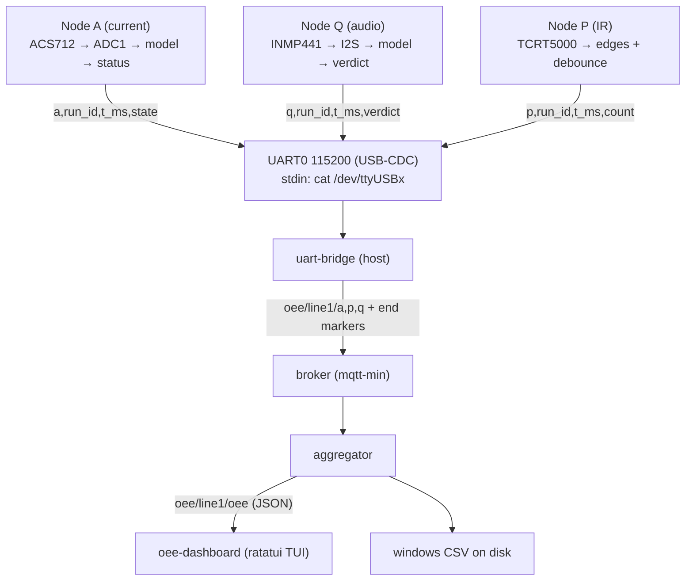

# Hardware: node data path and PC setup

> Created: 2026-09-12 20:06
> Based on a code review of: `firmware/{a,q,p,board,tools}`, `oee-aggregator`, `oee-dashboard`, `mqtt-min`
> Russian version: `kontext/guide/20260912200639-hardware-nodes-data-flow-ru.md`
> Related: `backlog/20260912160000-HARDWARE-assembly-guide.md` (bench assembly guide)

## 1. Data path: board → UART → MQTT → CSV/dashboard



### 1.1 What the nodes do

The boards store nothing — they only stream lines over UART0 (115200-8N1 via USB-CDC); the boards carry no network code at all.

| Node | Signal source                                                                             | Output                                                                  |
| ---- | ----------------------------------------------------------------------------------------- | ----------------------------------------------------------------------- |
| A    | ACS712 → ADC1 (~1.6 kHz), 128-sample window, startup zero calibration, model + hysteresis | status changes only, plus the diagnostic lines `a: boot`, `a: zero=NNN` |
| Q    | INMP441 → I2S 16 kHz, 1024-sample window (synthetic until S4)                             | one verdict per tap + the servo strike                                  |
| P    | TCRT5000, edges + 50 ms debounce                                                          | a cumulative count per part                                             |

Line formats:

```
a,<run_id>,<t_ms>,<state>     state: idle | run | jam | overload
q,<run_id>,<t_ms>,<verdict>   verdict: good | cracked
p,<run_id>,<t_ms>,<count>     count: cumulative counter
```

### 1.2 The uart-bridge

`cat /dev/ttyUSBx | uart-bridge 127.0.0.1:1883` — reads stdin, validates values against whitelists (`idle/run/jam/overload`, `good/cracked`), corrupt UTF-8 does not kill the stream, a publish failure degrades to a counter. Publishes hand-formatted JSON:

| Topic                  | Payload                                |
| ---------------------- | -------------------------------------- |
| `oee/line1/a/status`   | `{"t_ms":1234,"state":"run"}`          |
| `oee/line1/p/count`    | `{"t_ms":2000,"count":131}`            |
| `oee/line1/q/verdict`  | `{"t_ms":3000,"verdict":"good"}`       |
| `oee/line1/{node}/end` | empty payload — end of the node stream |

### 1.3 Aggregator: computation and storage

- Node streams are kept in memory as append-only, per-source time-ordered arrays: `(t_ms, is_run)`, `(t_ms, count)`, `(t_ms, is_good)`.
- Folds minute windows (60 s by default) plus a cumulative shift view (`scope`: `minute` | `shift`).
- Formulas: `A = run_ms/planned_ms`; `P = ideal_cycle_ms·parts/run_ms` (capped at 1.0); `Q = good/total` (1.0 when total=0); `OEE = A·P·Q`.
- Every closed window is published to `oee/line1/oee` (fixed-shape JSON, floats with 3 decimals).
- Persistent storage — a CSV on the host (`--out`, default `tmp/oee_windows.csv`, parent dirs auto-created), one row per window:

```
scope,run_id,t_from_ms,t_to_ms,planned_ms,run_ms,parts,good,total,a,p,q,oee
```

- Exits when every node from `--expect` has sent its end marker; the CSV rows already written stay valid after an abort.

### 1.4 Dashboard

ratatui TUI (~5 fps), subscribes to `oee/line1/#`, corrupt payloads are counted, never fatal:

- shift OEE/A/P/Q gauges (green zone ≥ 85%, yellow ≥ 60%);
- part counter, machine status, the Q verdict ticker;
- a minute-window OEE sparkline;
- `q` exits; a dropped broker shows as a red "reconnecting" status and heals itself.

## 2. Connecting the boards to the PC

- All three boards — one USB-C data cable each (not charge-only) into the board's **UART port** (not the native OTG one): `/dev/ttyUSB0..2`.
- The boards are powered over those same USB links; the servo — from a separate 5 V supply with a common ground.
- WiFi is not used: the "UART bridge vs WiFi" decision is deferred (S7 of the shakedown plan). The current-sense pin sits on ADC1 — headroom for a future WiFi move (ADC2 conflicts with it).

## 3. What the PC needs to receive messages

### 3.1 Port permissions (once)

```bash
sudo usermod -aG dialout $USER   # then log out and back in
```

### 3.2 Building the host tools (no esp toolchain needed)

```bash
cargo build -p mqtt-min --bin broker -p oee-aggregator -p oee-dashboard
(cd firmware && cargo build -p firmware-tools --bin uart-bridge)
```

### 3.3 Checking the ports and the raw stream

```bash
ls /dev/ttyUSB*        # expect ttyUSB0..2; not visible — hold BOOT while plugging in
stty -F /dev/ttyUSB0 115200 raw -echo && cat /dev/ttyUSB0
# expect lines like: a: boot, run_id=bench-a / a: zero=NNN / a,bench-a,...
```

### 3.4 The full loop

```bash
# Terminal 1 — broker + aggregator + dashboard (from the repo root)
./target/debug/broker 1883 &
./target/debug/aggregator --mqtt 127.0.0.1:1883 --ideal-cycle-ms 400 --out windows.csv
./target/debug/oee-dashboard --mqtt 127.0.0.1:1883

# Terminals 2..4 — one bridge per board
stty -F /dev/ttyUSB0 115200 raw -echo          # stty before cat: the bridge does not set the baud
cat /dev/ttyUSB0 | ./firmware/target/debug/uart-bridge 127.0.0.1:1883
```

### 3.5 Caveats

- The aggregator waits for end markers from **all** nodes in `--expect` (default `a,p,q`): when bringing up a single node, pass `--expect a`, otherwise the final flush never happens (intermediate windows are still written).
- Hardware-free smoke test (verified by running it):

```bash
printf 'a: boot, run_id=bench-a\na,bench-a,1000,run\nq,bench-q,2000,good\np,bench-p,3000,1\n' \
    | ./firmware/target/debug/uart-bridge 127.0.0.1:1883
# → bridge: 6 messages (a+p+q)   (3 status lines + 3 end markers; boot lines are ignored)
```

- Flashing the boards additionally needs the espup toolchain and `espflash` — sections 3–4 and 8 of the assembly guide.
