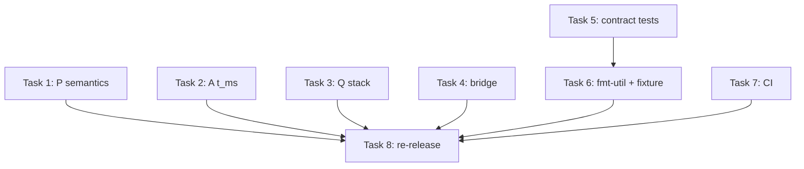

# Firmware backlog fix plan (cards 05/06/32/33/07/31/41/47)

> **For agentic workers:** use superpowers:subagent-driven-development (recommended) or superpowers:executing-plans — task by task. Steps use checkbox (`- [ ]`) syntax for tracking.

> **Execution status (2026-09-10):** fully implemented — the firmware workspace tests are green, the images are re-released as `firmware/bin/20260910101457-*`, cards 05/06/32/33/41 moved to `../resolved/`. Implementation deviations from the sketches below:
>
> - Task 1: the `bounce_storm…` test sketch had wrong expectations for the anchored window; implemented as `anchored_window_recovers_after_a_bounce_storm`.
> - Task 2: the 3-hour assertion is `10_800_000` ms (exactly 3 h), not `10_799_999`.
> - Task 3: measured headroom ~294 KiB vs ~25 KiB peak (esp-hal 1.2 has no stack-size knob — grep-verified); documented in `firmware/README(.ru).md`.
> - Task 5: `SAMPLE_US` was promoted to the lib already in Task 2.
> - Task 6: the Q fixture landed as the `good_window.rs` test-only module (not an inline const).
> - Task 8: the smoke passed (`bridge: 6 messages (a+p+q)`).

**Goal:** close every review card affecting the ESP32-S3 firmware quality and re-release the images into `firmware/bin/`.

**Architecture:** the node logic lives in host-testable `no_std` libs (`firmware/{a,q,p}/src/lib.rs`); the esp-hal code sits in `main.rs` behind `cfg(target_arch = "xtensa")`. Fixes go into the libs with TDD; the `main.rs`-specific parts (stack, t_us) are minimal edits with the testable core extracted into the lib.

**Tech Stack:** Rust (espup: rustc 1.97.0-nightly, esp-hal 1.2.0, target `xtensa-esp32s3-none-elf`), cargo workspaces (firmware/ is separate), mqtt-min, GitHub Actions CI.

**Specification (source cards):**

- `docs/eng/backlog/resolved/20260909120005-critical-counts-levels-not-edges-firmware-p-bl.md`
- `docs/eng/backlog/resolved/20260909120006-critical-tms-always-zero-firmware-a-bl.md`
- `docs/eng/backlog/resolved/20260909120032-important-q-stack-overflow-firmware-q-bl.md`
- `docs/eng/backlog/resolved/20260909120033-important-bridge-dies-on-bad-byte-firmware-tools-bl.md`
- `docs/eng/backlog/20260909120007-important-features-cli-contract-drift-workspace-bl.md` (firmware half)
- `docs/eng/backlog/20260909120031-important-qemu-not-in-ci-ci-bl.md` (firmware half: the espup pin + `--release`)
- `docs/eng/backlog/resolved/20260909120041-minor-firmware-bl.md`
- `docs/eng/backlog/20260909120047-rec-firmware-bl.md`

## Global constraints

- The node libs are `#![no_std]`: no `std`, no allocator; unsafe only with a safety comment (precedent: `qemu/src/uart.rs`).
- Host tests are mandatory: `cd firmware && cargo test --workspace` green after every task; clippy: `cargo clippy --workspace --all-targets -- -D warnings -A mismatched_lifetime_syntaxes`.
- Style: `cargo fmt --all` with no diff.
- The executor commits; the agent does not push or rewrite history.
- Destructive operations are forbidden: move the old `firmware/bin/20260910072946-*` artifacts to `tmp/trash/`, do not delete.
- The fixes must not change the line wire-formats (`a,<run_id>,<t_ms>,<state>` and the family) — they are pinned by the tests and the aggregator.

## An important correction to card 05 (read before task 1)

The review wording "a repeated count every ~51 ms while held" does **not reproduce in the current code**: `observe` extends the window on every swallowed sample (`firmware/p/src/lib.rs:43`), so at a 1 kHz poll (`POLL_MS = 1`) a held level yields exactly one count. The P `t_ms` is also correct (unlike A).

The real defects remaining from the card:

1. **No edge detection** (`prev_level`): the very first high level counts as a part — if the barrier is blocked at power-on, a phantom part. The host reference (`nodes/src/p.rs:81`) requires a preceding low level.
2. **The window extends** on swallowed samples instead of being anchored to the last counted event: an endless "bounce" (glitches every <50 ms) freezes the counter forever. The host (`nodes/src/p.rs:87-89`) recovers via the window from `last_counted`.
3. **The window boundary `<=`** instead of the reference's `<`; `wrapping_sub` instead of `saturating_sub`.

Task 1 is reformulated accordingly: align the mechanics with the host reference (which is exactly the "mirroring" the docs claim), keeping the deliberate constant difference (50 ms vs 100 ms — documented in the lib docs).

---

### Task 1: firmware-p — the host-reference semantics + trace parity (cards 05, 47)

**Files:**

- Modify: `firmware/p/src/lib.rs:17-56` (EdgeCounter), tests inside
- Modify: `nodes/src/p.rs` (tests: add the shared pinned trace)

**Interfaces:**

- Consumes: the `nodes::p::EdgeCounter::on_level` semantics (edge + window from `last_counted`, `saturating_sub`, `<`).
- Produces: `firmware_p::EdgeCounter::observe(&mut self, level: bool, t_ms: u32) -> Option<u32>` — the signature does not change; inside: `prev_level`, `last_counted`. Fields: `count()` stays.

- [ ] **Step 1.1: failing tests**

In `firmware/p/src/lib.rs`, the `tests` module: tests for a held-high level (exactly one count), a barrier blocked at boot (no phantom part without a low baseline), and window recovery after a glitch storm (the anchored window does not freeze).

- [ ] **Step 1.2: implementation**

```rust
pub struct EdgeCounter {
    debounce_ms: u32,
    last_level: Option<bool>,
    last_counted: Option<u32>,
    count: u32,
}

impl EdgeCounter {
    pub const fn new(debounce_ms: u32) -> Self {
        Self { debounce_ms, last_level: None, last_counted: None, count: 0 }
    }

    /// Feeds one barrier level at machine time `t_ms`; returns the new
    /// count when a part was counted. Mirrors `nodes::p::EdgeCounter`:
    /// a rising edge (low -> high) is a candidate; an edge within
    /// `debounce_ms` of the last *counted* part merges (the window is
    /// anchored, not extended).
    pub fn observe(&mut self, level: bool, t_ms: u32) -> Option<u32> {
        let rose = self.last_level == Some(false) && level;
        self.last_level = Some(level);
        if !rose {
            return None;
        }
        if let Some(last) = self.last_counted {
            if t_ms.saturating_sub(last) < self.debounce_ms {
                return None;
            }
        }
        self.last_counted = Some(t_ms);
        self.count += 1;
        Some(self.count)
    }

    pub const fn count(&self) -> u32 { self.count }
}
```

The existing tests `bounce_inside_the_window_is_swallowed` and `low_levels_never_count` are adapted to the new semantics (a preceding low first; the timings re-checked — the window no longer extends).

- [ ] **Step 1.3: trace parity with the host (card 47)**

The same pinned trace runs through both counters with the same 100 ms window, in `nodes/src/p.rs` (`mirror_trace_matches_the_firmware_counter`, with a `TRACE` const and the collected outputs) and in `firmware/p/src/lib.rs` (`mirror_trace_matches_the_host_counter`, sequential asserts — the lib is `no_std`, no `Vec` in tests). Expected outputs: `None, Some(1), None, None, None, Some(2), None, Some(3), None, None, Some(4)`.

- [ ] **Step 1.4: run + fmt**

```bash
cd firmware && cargo test -p firmware-p && cargo fmt --all
cd .. && cargo test -p nodes p::
```

- [ ] **Step 1.5: commit**

```bash
git add firmware/p/src/lib.rs nodes/src/p.rs
git commit -m "fix(firmware-p): mirror the host EdgeCounter semantics (edge + anchored window)" \
  -m "Review card 20260909120005: no prev_level meant a boot-blocked barrier counted a phantom part, and the extending window froze the counter under a permanent glitch storm. Anchored window + rising-edge detection now match nodes::p (pinned shared-trace test in both workspaces). DEBOUNCE_MS stays 50 ms (the documented hardware figure)."
```

---

### Task 2: firmware-a — a monotonic `t_ms` (card 06)

**Files:**

- Modify: `firmware/a/src/lib.rs` (a new helper + test)
- Modify: `firmware/a/src/main.rs:78-83`

**Interfaces:**

- Produces: `pub fn advance_ms(t_us: &mut u64, us: u32) -> u32` in `firmware_a` — microseconds accumulate, milliseconds are returned.

- [ ] **Step 2.1: failing test** (`firmware/a/src/lib.rs`, tests): a 3-hour monotonicity loop at `SAMPLE_US = 625` (the old code froze at 0), the final value exactly 3 h.

- [ ] **Step 2.2: implementation** (`firmware/a/src/lib.rs`)

```rust
/// Advances the microsecond clock and returns whole milliseconds.
/// `SAMPLE_US = 625` is not a whole number of ms — the naive
/// `t_ms += SAMPLE_US / 1000` froze at 0 (review card 20260909120006).
pub fn advance_ms(t_us: &mut u64, us: u32) -> u32 {
    *t_us += us as u64;
    (*t_us / 1000) as u32
}
```

- [ ] **Step 2.3: main.rs** — replace `let mut t_ms: u32 = 0` with `let mut t_us: u64 = 0`, and in the loop `let t_ms = advance_ms(&mut t_us, SAMPLE_US);`.

- [ ] **Step 2.4: run** — `cd firmware && cargo test -p firmware-a && cargo clippy --workspace --all-targets -- -D warnings -A mismatched_lifetime_syntaxes`

- [ ] **Step 2.5: commit**

```bash
git add firmware/a/src/lib.rs firmware/a/src/main.rs
git commit -m "fix(firmware-a): t_ms was always 0 (SAMPLE_US/1000 == 0)" \
  -m "Review card 20260909120006: accumulate microseconds in u64, divide at use. Pinned by a 3-hour monotonicity host test."
```

---

### Task 3: firmware-q — the stack: measure, pin, offload if needed (card 32)

esp-hal 1.2.0 has no `stack_size` in `Config` or in `#[esp_hal::main]` (registry-grep-verified) — the linker defines the stack bound, so the "likely overflow" becomes numbers.

**Files:**

- Modify: `firmware/q/src/main.rs:99` (the window goes static)
- Create: `firmware/README.md` + `firmware/README.ru.md` (a stack section in the "honest limits" style)

**Interfaces:** nothing new externally; the window changes location (static), not type.

- [ ] **Step 3.1: measure the available stack**

```bash
cd firmware && export PATH="$HOME/.rustup/toolchains/esp/bin:$PATH" && . "$HOME/export-esp.sh"
cargo build --release -p firmware-q --target xtensa-esp32s3-none-elf
xtensa-esp-elf-size -A target/xtensa-esp32s3-none-elf/release/firmware-q
```

From `size -A`: where the statics end; from `~/.cargo/registry/src/*/esp-hal-1.2.0/ld/esp32s3/memory.x` + `ld/sections/stack.x`: the `dram_seg` top (`_stack_start = ORIGIN(RWDATA) + LENGTH(RWDATA)` — the whole remaining DRAM is the stack). Peak need, conservatively: the window 4 KiB + the SMatrix copy 4 KiB + the predict int8 buffers ≈ 8.2 + 8.1 + ~8 KiB ≈ 25 KiB.

- [ ] **Step 3.2: decide by the numbers**

- If available > 4×25 KiB (expected on N16R8): no overflow — document the numbers (step 3.4) and still make the window static (step 3.3): it removes the largest frame and pins the intent.
- If less: a custom `memory.x`/`--defsym` for the stack (a separate step with the numbers from 3.1) and raise it in the card.

- [ ] **Step 3.3: the window goes static** (`firmware/q/src/main.rs`, inside `mod app`)

```rust
// SAFETY: single-threaded main loop; the buffer is never aliased
// (classify takes &[_]), and no interrupt handler touches it.
static mut WINDOW_BUF: [f32; WINDOW] = [0.0; WINDOW];
```

and in the loop: `let window = unsafe { &mut *core::ptr::addr_of_mut!(WINDOW_BUF) };` (taking `&mut` through `addr_of_mut!` — without the `static_mut_refs` lint).

- [ ] **Step 3.4: documentation**

Both READMEs (after "Flashing the boards", the "honest limits" style): the available stack per the 3.1 measurement, the peak estimate, the static-window fact, and the bring-up item: a high-water check before the real I2S driver (DMA buffers add on top) — from card 47.

- [ ] **Step 3.5: build + commit**

```bash
cargo build --release -p firmware-q -p firmware-a -p firmware-p --target xtensa-esp32s3-none-elf
git add firmware/q/src/main.rs firmware/README.md firmware/README.ru.md
git commit -m "fix(firmware-q): static window + measured stack headroom documented" \
  -m "Review card 20260909120032: esp-hal 1.2 has no stack_size knob (grep-verified), so the stack bound comes from the linker script. Measured DRAM headroom vs the ~25 KiB predict peak, moved the 4 KiB window to a static, documented the numbers + the bring-up high-water check."
```

---

### Task 4: uart-bridge — garbage and error resilience (card 33)

**Files:**

- Modify: `firmware/tools/src/bridge.rs` (reading, whitelists, end markers on all exits)
- Test: there, `mod tests`

**Interfaces:**

- Produces: `pub fn read_lossy_line<R: BufRead>(reader: &mut R, buf: &mut Vec<u8>) -> std::io::Result<Option<String>>` — reads up to `\n` without dying on invalid UTF-8.
- `line_to_publish` — the same signature; now rejects unknown `state`/`verdict`.

- [ ] **Step 4.1: failing tests**

Tests: lossy reading survives invalid UTF-8 (a bad row degrades to a skip, the next row parses); `unknown_state_or_verdict_is_rejected` (a `state` with a quote is rejected; only the known values pass).

- [ ] **Step 4.2: implementation**

`read_lossy_line` via `read_until(b'\n')` + `String::from_utf8_lossy`; the whitelists:

```rust
const STATES: [&str; 4] = ["idle", "run", "jam", "overload"];
const VERDICTS: [&str; 2] = ["good", "cracked"];
// ...
"a" if STATES.contains(&value) => format!("{{\"t_ms\":{t},\"state\":\"{value}\"}}"),
"q" if VERDICTS.contains(&value) => format!("{{\"t_ms\":{t},\"verdict\":\"{value}\"}}"),
```

The `run_bridge` loop: `while let Some(line) = read_lossy_line(...)` instead of `for line in input.lines()`; publish errors are counted (`publish_errors`) and the loop continues, not `?`; the end markers are published on EVERY exit path (the loop result is kept, the markers published, then the result returned). The summary line gains `, E publish errors` when non-zero.

- [ ] **Step 4.3: run** — `cd firmware && cargo test -p firmware-tools && cargo clippy --workspace --all-targets -- -D warnings -A mismatched_lifetime_syntaxes`

- [ ] **Step 4.4: commit**

```bash
git add firmware/tools/src/bridge.rs
git commit -m "fix(firmware-tools): uart-bridge survives serial garbage and publish errors" \
  -m "Review card 20260909120033: read_until + from_utf8_lossy instead of lines() (one bad byte used to kill the bridge), state/verdict whitelisted against JSON injection, end markers now published on every exit path, publish errors counted instead of aborting the loop."
```

---

### Task 5: `window_spec` contract tests in the firmwares (card 07, firmware half)

`features-cli` is already a dependency of both crates (`firmware/{a,q}/Cargo.toml:11`).

**Files:**

- Modify: `firmware/a/src/lib.rs` (tests), `firmware/q/src/lib.rs` (tests)

- [ ] **Step 5.1: the tests** (into both crates; in `a` — with the rate check via `SAMPLE_US`)

```rust
// firmware/a
#[test]
fn window_matches_the_features_cli_contract() {
    let spec = features_cli::window_spec(features_cli::NodeKind::A).unwrap();
    assert_eq!(WINDOW, spec.samples);
    assert_eq!(1_000_000 / SAMPLE_US, spec.sample_rate_hz); // 625 us -> 1600 Hz
}
```

`SAMPLE_US` is promoted from `main.rs` to the lib as `pub const` (in `q` — only the samples assert: the rate is fixed by the I2S driver, with a comment referencing `sample_rate_hz`).

- [ ] **Step 5.2: run** — `cd firmware && cargo test -p firmware-a -p firmware-q`

- [ ] **Step 5.3: commit**

```bash
git add firmware/a/src/lib.rs firmware/a/src/main.rs firmware/q/src/lib.rs
git commit -m "test(firmware): pin WINDOW constants to the features-cli contract" \
  -m "Review card 20260909120007 (firmware half): the constants were hand copies; a window_spec change would silently diverge models from firmware. SAMPLE_US promoted to the lib to assert the rate too."
```

---

### Task 6: cleanup (card 41) — fmt-util, argmax, the real Q fixture

**Files:**

- Create: `firmware/fmt-util/Cargo.toml`, `firmware/fmt-util/src/lib.rs`
- Modify: `firmware/Cargo.toml` (members + workspace.dependencies)
- Modify: `firmware/{a,q,p}/src/lib.rs` (drop the local Cursor/argmax), `firmware/q/src/lib.rs` (the fixture)

- [ ] **Step 6.1: the `fmt-util` crate**

`firmware/Cargo.toml`: `members = ["board", "a", "q", "p", "tools", "fmt-util"]`; in `[workspace.dependencies]`: `fmt-util = { path = "fmt-util" }`. In `{a,q,p}/Cargo.toml`: `fmt-util = { workspace = true }`.

The crate: the `Cursor` (as it was, from `firmware/a`, now `pub`) + a NaN-safe argmax with `total_cmp` (ties → the last maximum, matching `Iterator::max_by` — the host argmax semantics), with tests (buffer overflow is an `Err`; `+NaN` is the total-order maximum, `-NaN` the minimum).

- [ ] **Step 6.2: switch the consumers**

In `a`/`q` (`classify`) — `fmt_util::argmax(&probs)` instead of the `partial_cmp().unwrap()` block; in `p` — `fmt_util::Cursor` for the format. The local Cursor copies are deleted. Check: `grep -rn "partial_cmp().unwrap()" firmware/` is empty.

- [ ] **Step 6.3: the real Q fixture** (card 41, item 4)

The first label=0 data row of `ml/models/model_q.val.csv` (`label,x000..x1023` — the values are fields 2..1025), generated into `firmware/q/src/good_window.rs` as a `pub const GOOD_WINDOW: [f32; 1024]` (the `firmware-a` RUN_WINDOW pattern, `#[rustfmt::skip]`), a test-only module. The test asserts `verdict == 0` (good) — replacing the vacuous synthetic-window test.

- [ ] **Step 6.4: `format_capture`** — keep it (the S3 capture-mode contract), extend the doc: `/// The S3 capture-mode line; unused by the streaming main loop by design.`

- [ ] **Step 6.5: run + commit**

```bash
cd firmware && cargo test --workspace && cargo fmt --all && cargo clippy --workspace --all-targets -- -D warnings -A mismatched_lifetime_syntaxes
git add firmware/Cargo.toml firmware/fmt-util firmware/a firmware/q firmware/p
git commit -m "refactor(firmware): shared fmt-util (Cursor, NaN-safe argmax); real Q fixture" \
  -m "Review card 20260909120041: Cursor was copied 3x, argmax 2x with a NaN panic path; the Q parity test was vacuous (verdict < 2). Now one crate + a real label=good validation window as the fixture."
```

---

### Task 7: CI — the espup pin and `--release` (card 31, firmware half)

**Files:**

- Modify: `.github/workflows/ci.yml:91-106`

- [ ] **Step 7.1: the patch**

```yaml
      - name: Install espup and the Xtensa toolchain
        run: |
          cargo install espup --version 0.17.1 --locked
          espup install
          . ${HOME}/export-esp.sh

      - name: Build firmware (xtensa-esp32s3-none-elf)
        run: |
          . ${HOME}/export-esp.sh
          export PATH="${HOME}/.rustup/toolchains/esp/bin:${PATH}"
          cargo build --release \
            -p firmware-a -p firmware-q -p firmware-p \
            --target xtensa-esp32s3-none-elf
```

(0.17.1 — the version the current images were built with; the qemu job is outside this plan, see card 31.)

- [ ] **Step 7.2: a local YAML check** — `python3 -c "import yaml; yaml.safe_load(open('.github/workflows/ci.yml'))"` (or by eye).

- [ ] **Step 7.3: commit**

```bash
git add .github/workflows/ci.yml
git commit -m "ci(firmware): pin espup 0.17.1, build with --release" \
  -m "Review card 20260909120031 (firmware half): the unpinned espup drifts the toolchain, and the debug build never exercised the release LTO profile we actually flash."
```

---

### Task 8: image re-release + smoke (closing the loop)

**Files:**

- Create: `firmware/bin/<new-TS>-{firmware-a,firmware-q,firmware-p,build-info.md}`
- Move: `firmware/bin/20260910072946-*` → `tmp/trash/` (do not delete!)

- [ ] **Step 8.1: the full build**

```bash
cd firmware
export PATH="$HOME/.rustup/toolchains/esp/bin:$PATH" && . "$HOME/export-esp.sh"
cargo build --release -p firmware-a -p firmware-q -p firmware-p --target xtensa-esp32s3-none-elf
cargo test --workspace
```

- [ ] **Step 8.2: layout** (TS = `date +%Y%m%d%H%M%S` at build time): copy the three ELFs into `bin/$TS-*`, `sha256sum`, move the old `20260910072946-*` set to `../tmp/trash/`. The `build-info.md` follows the `20260910072946-build-info.md` template: the toolchain, the git HEAD (now with the fixes), the sha256, the stack numbers from task 3.

- [ ] **Step 8.3: the bridge smoke** (the README "live bridge check without a board"): the broker (`./target/debug/broker 1883 &`) + `printf ... | cargo run -p firmware-tools --bin uart-bridge -- 127.0.0.1:1883`; expected `bridge: 4 messages (a+p+q)`.

- [ ] **Step 8.4: commit**

```bash
git add firmware/bin
git commit -m "chore(firmware): re-release esp32s3 images with the review fixes" \
  -m "Rebuilt from <HEAD> after cards 05/06/32/33: P edge semantics, A t_ms, Q static window, hardened uart-bridge. Provenance: firmware/bin/<TS>-build-info.md."
```

---

## Order and dependencies



Tasks 1–5 and 7 are independent; task 6 after 5 (the task-5 test moves to the `fmt-util` version of `classify` without logic changes). Task 8 is last, when everything is green.

## Out of scope (adjacent cards, separate plans)

- `20260909120002` — the aggregator timeout (the paired protection to task 4, but it is root-workspace);
- `20260909120007` — the nodes/trainer halves of the contract tests;
- `20260909120031` — the qemu CI job;
- `20260909120035` item 3 — the buffer pool in `nodes::status` (host code).
