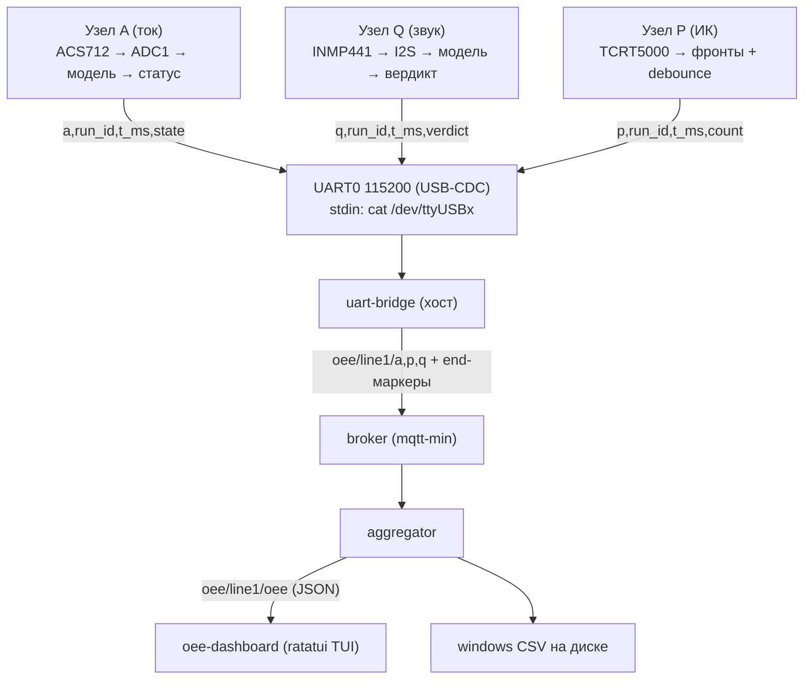

# Железо: путь данных узлов и настройка ПК

> Создано: 2026-09-12 20:06
> Основано на разборе кода: `firmware/{a,q,p,board,tools}`, `oee-aggregator`, `oee-dashboard`, `mqtt-min`
> Смежное: `backlog/20260912160000-HARDWARE-assembly-guide-ru.md` (гайд по сборке железа)

## 1. Путь данных: плата → UART → MQTT → CSV/дашборд



### 1.1 Что делают узлы

Платы ничего не хранят — только стримят строки в UART0 (115200-8N1 через USB-CDC); сетевого кода на платах нет.

| Узел | Источник сигнала                                                                    | Наружу                                                                     |
| ---- | ----------------------------------------------------------------------------------- | -------------------------------------------------------------------------- |
| A    | ACS712 → ADC1 (~1,6 кГц), окно 128, калибровка нуля при старте, модель + гистерезис | только изменения статуса + диагностические строки `a: boot`, `a: zero=NNN` |
| Q    | INMP441 → I2S 16 кГц, окно 1024 (до S4 — синтетическое окно)                        | вердикт на каждый тап + удар серво                                         |
| P    | TCRT5000, фронты + debounce 50 мс                                                   | кумулятивный счёт на каждую деталь                                         |

Форматы строк:

```
a,<run_id>,<t_ms>,<state>     state: idle | run | jam | overload
q,<run_id>,<t_ms>,<verdict>   verdict: good | cracked
p,<run_id>,<t_ms>,<count>     count: кумулятивный счётчик
```

### 1.2 Мост uart-bridge

`cat /dev/ttyUSBx | uart-bridge 127.0.0.1:1883` — читает stdin, валидирует значения по белым спискам (`idle/run/jam/overload`, `good/cracked`), битый UTF-8 не роняет поток, ошибка публикации деградирует в счётчик. Публикует JSON ручной сборки:

| Топик                  | Payload                            |
| ---------------------- | ---------------------------------- |
| `oee/line1/a/status`   | `{"t_ms":1234,"state":"run"}`      |
| `oee/line1/p/count`    | `{"t_ms":2000,"count":131}`        |
| `oee/line1/q/verdict`  | `{"t_ms":3000,"verdict":"good"}`   |
| `oee/line1/{node}/end` | пустой payload — конец потока узла |

### 1.3 Агрегатор: вычисления и хранение

- Потоки узлов хранятся в памяти как append-only, per-source time-ordered массивы: `(t_ms, is_run)`, `(t_ms, count)`, `(t_ms, is_good)`.
- Сворачивает минутные окна (по умолчанию 60 с) + кумулятивную «смену» (`scope`: `minute` | `shift`).
- Формулы: `A = run_ms/planned_ms`; `P = ideal_cycle_ms·parts/run_ms` (кап 1.0); `Q = good/total` (1.0 при total=0); `OEE = A·P·Q`.
- Каждое закрытое окно публикуется в `oee/line1/oee` (JSON фиксированной формы, float с 3 знаками).
- Персистентное хранилище — CSV на хосте (`--out`, по умолчанию `tmp/oee_windows.csv`, директории создаются сами), одна строка на окно:

```
scope,run_id,t_from_ms,t_to_ms,planned_ms,run_ms,parts,good,total,a,p,q,oee
```

- Завершается, когда все узлы из `--expect` прислали end-маркер; уже записанные строки CSV остаются валидными при обрыве.

### 1.4 Дашборд

ratatui TUI (~5 fps), подписка `oee/line1/#`, искажённые payload считает и не падает:

- шкалы OEE/A/P/Q за смену (зелёная зона ≥ 85%, жёлтая ≥ 60%);
- счётчик деталей, статус станка, лента вердиктов Q;
- спарклайн OEE по минутным окнам;
- `q` — выход; обрыв брокера — красный «reconnecting» с самовосстановлением.

## 2. Подключение плат к ПК

- Все три платы — по USB-C data-кабелю (не charge-only) к **UART-порту** платы (не native OTG): `/dev/ttyUSB0..2`.
- Платы питаются от этих же USB; серво — от отдельного БП 5 В с общим GND.
- WiFi не используется: решение «UART-мост vs WiFi» отложено (S7 плана обкатки). Пин тока посажен на ADC1 — задел под будущий WiFi (ADC2 конфликтует с ним).

## 3. Что нужно на ПК для приёма сообщений

### 3.1 Права на порты (один раз)

```bash
sudo usermod -aG dialout $USER   # затем перелогиниться
```

### 3.2 Сборка host-инструментов (esp-тулчейн не нужен)

```bash
cargo build -p mqtt-min --bin broker -p oee-aggregator -p oee-dashboard
(cd firmware && cargo build -p firmware-tools --bin uart-bridge)
```

### 3.3 Проверка портов и сырого потока

```bash
ls /dev/ttyUSB*        # ожидаем ttyUSB0..2; не видны — зажать BOOT при подключении
stty -F /dev/ttyUSB0 115200 raw -echo && cat /dev/ttyUSB0
# ждём строки вида: a: boot, run_id=bench-a / a: zero=NNN / a,bench-a,...
```

### 3.4 Полный контур

```bash
# Терминал 1 — брокер + агрегатор + дашборд (из корня репо)
./target/debug/broker 1883 &
./target/debug/aggregator --mqtt 127.0.0.1:1883 --ideal-cycle-ms 400 --out windows.csv
./target/debug/oee-dashboard --mqtt 127.0.0.1:1883

# Терминалы 2..4 — по одному мосту на плату
stty -F /dev/ttyUSB0 115200 raw -echo          # stty до cat: мост скорость не настраивает
cat /dev/ttyUSB0 | ./firmware/target/debug/uart-bridge 127.0.0.1:1883
```

### 3.5 Нюансы

- Агрегатор ждёт end-маркеры от **всех** узлов из `--expect` (по умолчанию `a,p,q`): при обкатке одного узла указывать `--expect a`, иначе финальный флаш не случится (промежуточные окна пишутся и так).
- Smoke-тест без железа (проверено запуском):

```bash
printf 'a: boot, run_id=bench-a\na,bench-a,1000,run\nq,bench-q,2000,good\np,bench-p,3000,1\n' \
    | ./firmware/target/debug/uart-bridge 127.0.0.1:1883
# → bridge: 6 messages (a+p+q)   (3 статус-строки + 3 end-маркера; boot-строки игнорируются)
```

- Для прошивки плат дополнительно нужны espup-тулчейн и `espflash` — разделы 3–4 и 8 гайда по сборке.
