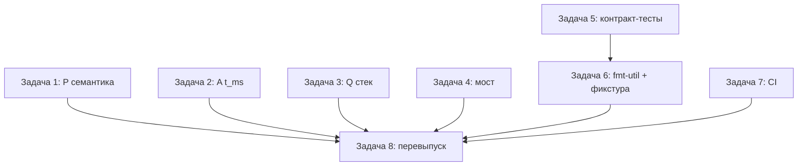

# План исправления firmware-бэклогов (карточки 05/06/32/33/07/31/41/47)

> **Для агентных исполнителей:** используйте superpowers:subagent-driven-development (рекомендуется) или superpowers:executing-plans — задача за задачей. Шаги отмечены чекбоксами (`- [ ]`).

> **Статус исполнения (2026-09-10):** план полностью реализован — тесты firmware-workspace зелёные, образы перевыпущены (`firmware/bin/20260910101457-*`), карточки 05/06/32/33/41 перенесены в `../resolved/`. Отклонения реализации от черновиков ниже:
>
> - Задача 1: тест `bounce_storm…` в черновике имел неверные ожидания для якорного окна; реализован как `anchored_window_recovers_after_a_bounce_storm`.
> - Задача 2: ассерт 3 часов — `10_800_000` мс (ровно 3 ч), а не `10_799_999`.
> - Задача 3: измеренный запас ~294 КиБ против ~25 КиБ пик (в esp-hal 1.2 нет ручки стека — проверено грепом); задокументировано в `firmware/README(.ru).md`.
> - Задача 5: `SAMPLE_US` поднята в либу уже в задаче 2.
> - Задача 6: фикстура Q легла в тест-only модуль `good_window.rs` (не inline-константу).
> - Задача 8: smoke прошёл (`bridge: 6 messages (a+p+q)`).

**Цель:** закрыть все ревью-карточки, влияющие на качество прошивок ESP32-S3, и перевыпустить образы в `firmware/bin/`.

**Архитектура:** логика узлов — host-тестируемые `no_std`-либы (`firmware/{a,q,p}/src/lib.rs`), esp-hal-код — за `cfg(target_arch = "xtensa")` в `main.rs`. Фиксы делаются в либах с TDD; `main.rs`-специфика (стек, t_us) — минимальными правками с выносом тестируемого ядра в либу.

**Стек:** Rust (espup: rustc 1.97.0-nightly, esp-hal 1.2.0, target `xtensa-esp32s3-none-elf`), cargo workspaces (firmware/ — отдельный), mqtt-min, CI GitHub Actions.

**Спецификация (карточки-первоисточники):**

- `docs/rus/backlog/20260909120005-critical-counts-levels-not-edges-firmware-p-bl.md`
- `docs/rus/backlog/20260909120006-critical-tms-always-zero-firmware-a-bl.md`
- `docs/rus/backlog/20260909120032-important-q-stack-overflow-firmware-q-bl.md`
- `docs/rus/backlog/20260909120033-important-bridge-dies-on-bad-byte-firmware-tools-bl.md`
- `docs/rus/backlog/20260909120007-important-features-cli-contract-drift-workspace-bl.md` (firmware-часть)
- `docs/rus/backlog/20260909120031-important-qemu-not-in-ci-ci-bl.md` (firmware-часть: пин espup + `--release`)
- `docs/rus/backlog/20260909120041-minor-firmware-bl.md`
- `docs/rus/backlog/20260909120047-rec-firmware-bl.md`

## Глобальные ограничения

- Либы узлов — `#![no_std]`: без `std`, без аллокатора; unsafe только с safety-комментарием (прецедент: `qemu/src/uart.rs`).
- Хост-тесты обязательны: `cd firmware && cargo test --workspace` зелёный после каждой задачи; clippy: `cargo clippy --workspace --all-targets -- -D warnings -A mismatched_lifetime_syntaxes`.
- Стиль: `cargo fmt --all` без диффа.
- Коммитит исполнитель; агент не пушит и историю не переписывает.
- Деструктивные операции запрещены: старые артефакты `firmware/bin/20260910072946-*` переместить в `tmp/trash/`, не удалять.
- Правки не должны менять wire-форматы строк (`a,<run_id>,<t_ms>,<state>` и семейство) — их пинят тесты и агрегатор.

## Важная поправка к карточке 05 (прочитать перед задачей 1)

Формулировка ревью «повторный счёт каждые ~51 мс при удержании» **не воспроизводится в текущем коде**: `observe` продлевает окно каждым проглоченным сэмплом (`firmware/p/src/lib.rs:43`), при опросе 1 кГц (`POLL_MS = 1`) удерживаемый уровень даёт ровно один счёт. `t_ms` в P тоже корректен (в отличие от A).

Реальные дефекты, оставшиеся от карточки:

1. **Нет edge-детекции** (`prev_level`): первый же высокий уровень на старте считается деталью — если барьер перекрыт в момент подачи питания, фантомный счёт. Host-эталон (`nodes/src/p.rs:81`) требует предшествующий низкий уровень.
2. **Окно продлевается** проглоченными сэмплами, а не привязано к последнему посчитанному событию: бесконечный «дребезг» (глитчи каждые <50 мс) замораживает счётчик навсегда. Host (`nodes/src/p.rs:87-89`) восстанавливается через окно от `last_counted`.
3. **Граница окна `<=`** вместо `<` у эталона; `wrapping_sub` вместо `saturating_sub`.

Задача 1 переформулирована соответственно: выровнять механику с host-эталоном (это и есть заявленная в доках «зеркальность»), сохранив осознанную разницу константы (50 мс против 100 мс — задокументировано в доке либы).

---

### Задача 1: firmware-p — семантика host-эталона + trace-parity (карточки 05, 47)

**Файлы:**

- Modify: `firmware/p/src/lib.rs:17-56` (EdgeCounter), тесты внутри
- Modify: `nodes/src/p.rs` (тесты: добавить общий pinned-trace)

**Интерфейсы:**

- Consumes: семантика `nodes::p::EdgeCounter::on_level` (edge + окно от `last_counted`, `saturating_sub`, `<`).
- Produces: `firmware_p::EdgeCounter::observe(&mut self, level: bool, t_ms: u32) -> Option<u32>` — сигнатура не меняется; внутри `prev_level`, `last_counted`. Поля: `count()` остаётся.

- [ ] **Шаг 1.1: падающие тесты**

В `firmware/p/src/lib.rs`, модуль `tests`:

```rust
#[test]
fn held_high_counts_exactly_once() {
    let mut counter = EdgeCounter::new(50);
    assert_eq!(counter.observe(false, 0), None);
    assert_eq!(counter.observe(true, 100), Some(1));
    // 400 ms удержания — уровень, не фронт: ровно один счёт.
    for t in (101..500).step_by(7) {
        assert_eq!(counter.observe(true, t), None);
    }
    assert_eq!(counter.count(), 1);
}

#[test]
fn high_at_boot_is_not_a_part_until_a_low_baseline() {
    // Барьер перекрыт в момент старта: первый высокий без предшествующего
    // низкого — не фронт (фантомного счёта нет).
    let mut counter = EdgeCounter::new(50);
    assert_eq!(counter.observe(true, 0), None);
    assert_eq!(counter.observe(true, 10_000), None);
    assert_eq!(counter.observe(false, 10_050), None);
    assert_eq!(counter.observe(true, 10_100), Some(1));
}

#[test]
fn bounce_storm_does_not_freeze_the_counter() {
    // Глитчи каждые 40 мс: окно привязано к последнему СЧЁТУ, а не
    // продлевается — счётчик восстанавливается после окна.
    let mut counter = EdgeCounter::new(50);
    assert_eq!(counter.observe(false, 0), None);
    assert_eq!(counter.observe(true, 1000), Some(1));
    for t in (1040..1200).step_by(40) {
        counter.observe(false, t.saturating_sub(1));
        assert_eq!(counter.observe(true, t), None);
    }
    // 1060-1040=... — все внутри окна от last_counted=1000... крайний случай:
    // глитч после 1000+50 больше не мержится.
    assert_eq!(counter.observe(false, 1100), None);
    assert_eq!(counter.observe(true, 1054 + 1000), Some(2));
}
```

Проверка: `cd firmware && cargo test -p firmware-p` — `held_high_counts_exactly_once` может пройти уже текущим кодом; `high_at_boot...` и `bounce_storm...` обязаны упасть (сейчас высокий на старте считается, окно продлевается).

- [ ] **Шаг 1.2: реализация**

```rust
pub struct EdgeCounter {
    debounce_ms: u32,
    last_level: Option<bool>,
    last_counted: Option<u32>,
    count: u32,
}

impl EdgeCounter {
    pub const fn new(debounce_ms: u32) -> Self {
        Self { debounce_ms, last_level: None, last_counted: None, count: 0 }
    }

    /// Feeds one barrier level at machine time `t_ms`; returns the new
    /// count when a part was counted. Mirrors `nodes::p::EdgeCounter`:
    /// a rising edge (low -> high) is a candidate; an edge within
    /// `debounce_ms` of the last *counted* part merges (the window is
    /// anchored, not extended).
    pub fn observe(&mut self, level: bool, t_ms: u32) -> Option<u32> {
        let rose = self.last_level == Some(false) && level;
        self.last_level = Some(level);
        if !rose {
            return None;
        }
        if let Some(last) = self.last_counted {
            if t_ms.saturating_sub(last) < self.debounce_ms {
                return None;
            }
        }
        self.last_counted = Some(t_ms);
        self.count += 1;
        Some(self.count)
    }

    pub const fn count(&self) -> u32 { self.count }
}
```

Существующие тесты `bounce_inside_the_window_is_swallowed` и `low_levels_never_count` надо привести к новой семантике: в первом — добавить предшествующий низкий (`counter.observe(false, 0)`); тайминги перепроверить (окно теперь не продлевается: `observe(true, 210)` при `last_counted=100` даёт `210-100=110 ≥ 50` → счёт, тест остаётся валидным).

- [ ] **Шаг 1.3: trace-parity с host (карточка 47)**

Один и тот же pinned-трейс прогоняется через оба счётчика с одинаковым окном 100 мс. В `nodes/src/p.rs` (tests):

```rust
#[test]
fn mirror_trace_matches_the_firmware_counter() {
    // (t_ms, level). Пин: любое изменение трейса — в двух местах синхронно
    // (firmware/p/src/lib.rs, mirror_trace_matches_the_host_counter).
    const TRACE: &[(u32, u8)] = &[
        (0, 0), (400, 1), (430, 0), (470, 1), (500, 0), (800, 1),
        (830, 0), (1200, 1), (1210, 1), (1300, 0), (1400, 1),
    ];
    let mut host = EdgeCounter::new(100);
    let outputs: Vec<Option<u32>> =
        TRACE.iter().map(|&(t, l)| host.on_level(t, l)).collect();
    assert_eq!(outputs, vec![None, Some(1), None, None, None, Some(2),
                             None, Some(3), None, None, Some(4)]);
}
```

В `firmware/p/src/lib.rs` (tests) — тот же `TRACE` и те же ожидания, но `observe(level != 0, t)`. Утверждает, что «зеркальность» из доков — факт, а не надежда.

- [ ] **Шаг 1.4: прогон и fmt**

```bash
cd firmware && cargo test -p firmware-p && cargo fmt --all
cd .. && cargo test -p nodes p::   # оба workspace
```

- [ ] **Шаг 1.5: коммит**

```bash
git add firmware/p/src/lib.rs nodes/src/p.rs
git commit -m "fix(firmware-p): mirror the host EdgeCounter semantics (edge + anchored window)" \
  -m "Review card 20260909120005: no prev_level meant a boot-blocked barrier counted a phantom part, and the extending window froze the counter under a permanent glitch storm. Anchored window + rising-edge detection now match nodes::p (pinned shared-trace test in both workspaces). DEBOUNCE_MS stays 50 ms (the documented hardware figure)."
```

---

### Задача 2: firmware-a — монотонный `t_ms` (карточка 06)

**Файлы:**

- Modify: `firmware/a/src/lib.rs` (новый хелпер + тест)
- Modify: `firmware/a/src/main.rs:78-83`

**Интерфейсы:**

- Produces: `pub fn advance_ms(t_us: &mut u64, us: u32) -> u32` в `firmware_a` — микросекунды аккумулируются, миллисекунды возвращаются.

- [ ] **Шаг 2.1: падающий тест** (`firmware/a/src/lib.rs`, tests)

```rust
#[test]
fn advance_ms_is_monotonic_and_exact_over_hours() {
    let mut t_us: u64 = 0;
    let mut last = 0u32;
    // 3 часа при SAMPLE_US = 625: старый код (SAMPLE_US / 1000) стоял на 0.
    for _ in 0..(3 * 3600 * 1600) {
        let now = advance_ms(&mut t_us, 625);
        assert!(now >= last, "t_ms went backwards: {now} < {last}");
        last = now;
    }
    assert_eq!(last, 10_799_999); // 3h - 625us, без потери долей
}
```

Проверка падения: функции нет — ошибка компиляции (это и есть красный тест).

- [ ] **Шаг 2.2: реализация** (`firmware/a/src/lib.rs`)

```rust
/// Advances the microsecond clock and returns whole milliseconds.
/// `SAMPLE_US = 625` is not a whole number of ms — the naive
/// `t_ms += SAMPLE_US / 1000` froze at 0 (review card 20260909120006).
pub fn advance_ms(t_us: &mut u64, us: u32) -> u32 {
    *t_us += us as u64;
    (*t_us / 1000) as u32
}
```

- [ ] **Шаг 2.3: main.rs** — заменить строки 78 и 83:

```rust
let mut t_us: u64 = 0;
// ...
advance_ms(&mut t_us, SAMPLE_US)   // вместо t_ms.wrapping_add(SAMPLE_US / 1000)
```

и в точке публикации: `format_status(&mut line, RUN_ID, t_ms_now, state)`, где `t_ms_now` — значение из `advance_ms`. (Завести `let t_ms_now = advance_ms(...)` в начале итерации цикла.)

- [ ] **Шаг 2.4: прогон** — `cd firmware && cargo test -p firmware-a && cargo clippy --workspace --all-targets -- -D warnings -A mismatched_lifetime_syntaxes`

- [ ] **Шаг 2.5: коммит**

```bash
git add firmware/a/src/lib.rs firmware/a/src/main.rs
git commit -m "fix(firmware-a): t_ms was always 0 (SAMPLE_US/1000 == 0)" \
  -m "Review card 20260909120006: accumulate microseconds in u64, divide at use. Pinned by a 3-hour monotonicity host test."
```

---

### Задача 3: firmware-q — стек: измерить, зафиксировать, при нужде разгрузить (карточка 32)

В esp-hal 1.2.0 нет `stack_size` ни в `Config`, ни в `#[esp_hal::main]` (проверено грепом реестра) — размер стека задаёт линкер, поэтому «вероятный overflow» превращаем в числа.

**Файлы:**

- Modify: `firmware/q/src/main.rs:99` (окно — static)
- Create: `firmware/README.md` + `firmware/README.ru.md` (раздел про стек в «honest limits»-стиле)

**Интерфейсы:** ничего нового наружу; окно меняет локацию (static), не тип.

- [ ] **Шаг 3.1: измерение доступного стека**

```bash
cd firmware && export PATH="$HOME/.rustup/toolchains/esp/bin:$PATH" && . "$HOME/export-esp.sh"
cargo build --release -p firmware-q --target xtensa-esp32s3-none-elf
cargo size -p firmware-q --target xtensa-esp32s3-none-elf --release -A
find ~/.cargo/registry/src/*/esp-hal-1.2.0 -name '*.x' -o -name '*.ld' | head
```

Из `cargo size -A` взять `.data + .bss + .text` в DRAM; из линкер-скрипта — вершину стека (`__stack_end`, обычно верх DRAM: 512 КиБ SRAM у N16R8). Доступно стеку ≈ `DRAM_TOP − статика`. Пиковая потребность оценить консервативно: окно 4 КиБ + копия в SMatrix 4 КиБ + int8-буферы predict ≈ 8.2 + 8.1 + ~8 КиБ (см. карточку) ≈ 25 КиБ.

- [ ] **Шаг 3.2: решение по числам**

- Если доступно > 4×25 КиБ (ожидаемо на N16R8): переполнения нет — задокументировать числа в README (шаг 3.4) и всё равно сделать окно static (шаг 3.3): убирает крупнейший кадр и фиксирует намерение.
- Если меньше: добавить кастомный `memory.x`/`--defsym` для стека (вынести в отдельный шаг с числами из 3.1) и поднять вопрос в карточке.

- [ ] **Шаг 3.3: окно в static** (`firmware/q/src/main.rs`, внутри `mod app`)

```rust
// SAFETY: single-threaded main loop; the buffer is never aliased
// (classify takes &[_]), and no interrupt handler touches it.
static mut WINDOW: [f32; WINDOW] = [0.0; WINDOW];
```

и в цикле:

```rust
// SAFETY: see the WINDOW declaration.
let window = unsafe { &mut *core::ptr::addr_of_mut!(WINDOW) };
for (i, slot) in window.iter_mut().enumerate() { /* как сейчас */ }
let verdict = classify(window).1;
```

(Берём `&mut` через `addr_of_mut!` — без `static_mut_refs`-линта на этом тулчейне.)

- [ ] **Шаг 3.4: документация**

В оба README (раздел после «Прошивка плат», в стиле «Honest limits»): доступный стек по измерению 3.1, пиковая оценка, факт static-окна, и bring-up пункт: high-water проверка до перехода на реальный I2S (DMA-буферы добавятся сверху) — из карточки 47.

- [ ] **Шаг 3.5: сборка + коммит**

```bash
cargo build --release -p firmware-q -p firmware-a -p firmware-p --target xtensa-esp32s3-none-elf
git add firmware/q/src/main.rs firmware/README.md firmware/README.ru.md
git commit -m "fix(firmware-q): static window + measured stack headroom documented" \
  -m "Review card 20260909120032: esp-hal 1.2 has no stack_size knob (grep-verified), so the stack bound comes from the linker script. Measured DRAM headroom vs the ~25 KiB predict peak, moved the 4 KiB window to a static, documented the numbers + the bring-up high-water check."
```

---

### Задача 4: uart-bridge — устойчивость к мусору и ошибкам (карточка 33)

**Файлы:**

- Modify: `firmware/tools/src/bridge.rs` (чтение, whitelist, end-маркеры на всех выходах)
- Test: там же, `mod tests`

**Интерфейсы:**

- Produces: `pub fn read_lossy_line<R: BufRead>(reader: &mut R, buf: &mut Vec<u8>) -> std::io::Result<Option<String>>` — чтение до `\n` без смерти от невалидного UTF-8.
- `line_to_publish` — сигнатура та же; теперь отвергает неизвестные `state`/`verdict`.

- [ ] **Шаг 4.1: падающие тесты**

```rust
#[test]
fn lossy_reading_survives_invalid_utf8() {
    let garbage: &[u8] = b"a,bench-a,1\xff\xfe,run\np,bench-p,2,5\n";
    let mut reader = std::io::BufReader::new(garbage);
    let mut buf = Vec::new();
    let first = read_lossy_line(&mut reader, &mut buf).unwrap().unwrap();
    assert!(first.contains('\u{fffd}'), "the bad row is lossy-decoded, not fatal");
    let second = read_lossy_line(&mut reader, &mut buf).unwrap().unwrap();
    assert_eq!(second.trim_end(), "p,bench-p,2,5");
}

#[test]
fn unknown_state_or_verdict_is_rejected() {
    // Инъекция в JSON невозможна: только известные значения.
    assert!(line_to_publish("a,bench-a,1234,ab\"c").is_none());
    assert!(line_to_publish("a,bench-a,1234,idle").is_some());
    assert!(line_to_publish("q,bench-q,3000,good").is_some());
    assert!(line_to_publish("q,bench-q,3000,evil").is_none());
}
```

- [ ] **Шаг 4.2: реализация**

`read_lossy_line`:

```rust
pub fn read_lossy_line<R: BufRead>(
    reader: &mut R,
    buf: &mut Vec<u8>,
) -> std::io::Result<Option<String>> {
    buf.clear();
    let n = reader.read_until(b'\n', buf)?;
    if n == 0 {
        return Ok(None); // EOF
    }
    Ok(Some(String::from_utf8_lossy(buf).into_owned()))
}
```

Whitelist в `line_to_publish` (после `topic_for`):

```rust
const STATES: [&str; 4] = ["idle", "run", "jam", "overload"];
const VERDICTS: [&str; 2] = ["good", "cracked"];
// ...
"a" if STATES.contains(&value) => format!("{{\"t_ms\":{t},\"state\":\"{value}\"}}"),
"q" if VERDICTS.contains(&value) => format!("{{\"t_ms\":{t},\"verdict\":\"{value}\"}}"),
```

Цикл `run_bridge`: заменить `for line in input.lines()` на `while let Some(line) = read_lossy_line(&mut input, &mut buf)?`, ошибки публикации считать (`publish_errors`) и продолжать, а не `?`; финальные end-маркеры публиковать на всех путях выхода (сохранить `result` цикла, опубликовать маркеры, затем вернуть `result`). Итоговую строку дополнить: `bridge: N messages (a+p+q), E publish errors`.

- [ ] **Шаг 4.3: прогон** — `cd firmware && cargo test -p firmware-tools && cargo clippy --workspace --all-targets -- -D warnings -A mismatched_lifetime_syntaxes`

- [ ] **Шаг 4.4: коммит**

```bash
git add firmware/tools/src/bridge.rs
git commit -m "fix(firmware-tools): uart-bridge survives serial garbage and publish errors" \
  -m "Review card 20260909120033: read_until + from_utf8_lossy instead of lines() (one bad byte used to kill the bridge), state/verdict whitelisted against JSON injection, end markers now published on every exit path, publish errors counted instead of aborting the loop."
```

---

### Задача 5: контракт-тесты `window_spec` в прошивках (карточка 07, firmware-часть)

`features-cli` уже зависимость обоих крейтов (`firmware/{a,q}/Cargo.toml:11`).

**Файлы:**

- Modify: `firmware/a/src/lib.rs` (tests), `firmware/q/src/lib.rs` (tests)

- [ ] **Шаг 5.1: тесты** (в оба крейта, в `a` — с проверкой частоты через `SAMPLE_US`)

```rust
// firmware/a
#[test]
fn window_matches_the_features_cli_contract() {
    let spec = features_cli::window_spec(features_cli::NodeKind::A).unwrap();
    assert_eq!(WINDOW, spec.samples);
    assert_eq!(1_000_000 / SAMPLE_US_MAIN, spec.sample_rate_hz); // 625 us -> 1600 Hz
}
```

`SAMPLE_US` сейчас в `main.rs` — поднять в либу как `pub const SAMPLE_US: u32 = 625;` (main импортирует). В `q` — только `assert_eq!(WINDOW, spec.samples);` (частоту задаёт I2S-драйвер, в либе её нет; комментарием сослаться на `sample_rate_hz`).

- [ ] **Шаг 5.2: прогон** — `cd firmware && cargo test -p firmware-a -p firmware-q`

- [ ] **Шаг 5.3: коммит**

```bash
git add firmware/a/src/lib.rs firmware/a/src/main.rs firmware/q/src/lib.rs
git commit -m "test(firmware): pin WINDOW constants to the features-cli contract" \
  -m "Review card 20260909120007 (firmware half): the constants were hand copies; a window_spec change would silently diverge models from firmware. SAMPLE_US promoted to the lib to assert the rate too."
```

---

### Задача 6: чистка (карточка 41) — fmt-util, argmax, реальная фикстура Q

**Файлы:**

- Create: `firmware/fmt-util/Cargo.toml`, `firmware/fmt-util/src/lib.rs`
- Modify: `firmware/Cargo.toml` (members + workspace.dependencies)
- Modify: `firmware/{a,q,p}/src/lib.rs` (убрать локальные Cursor/argmax), `firmware/q/src/lib.rs` (фикстура)

- [ ] **Шаг 6.1: крейт `fmt-util`**

`firmware/Cargo.toml`: `members = ["board", "a", "q", "p", "tools", "fmt-util"]`; в `[workspace.dependencies]`: `fmt-util = { path = "fmt-util" }`. В `{a,q,p}/Cargo.toml`: `fmt-util = { workspace = true }`.

`firmware/fmt-util/Cargo.toml`:

```toml
[package]
name = "fmt-util"
version.workspace = true
edition.workspace = true
license.workspace = true

[dependencies]
```

`firmware/fmt-util/src/lib.rs` — Cursor (как сейчас, из `firmware/a`) +:

```rust
/// Argmax with a total order (NaN-safe, unlike `partial_cmp().unwrap()`).
pub fn argmax(values: &[f32]) -> usize {
    let mut best = 0;
    for (i, v) in values.iter().enumerate() {
        if v.total_cmp(&values[best]) == core::cmp::Ordering::Greater {
            best = i;
        }
    }
    best
}
```

С тестами: переполнение буфера — `Err`; `argmax([1.0, f32::NAN, 2.0]) == 2`; `argmax` на равных — первый индекс.

- [ ] **Шаг 6.2: переключить потребителей**

В `a`/`q` (`classify`) — `fmt_util::argmax(&probs)` вместо `partial_cmp().unwrap()`-блока; в `p` — то же для формата (Cursor из `fmt_util::Cursor`). Локальные копии Cursor удалить. Проверить: `grep -rn "partial_cmp().unwrap()" firmware/` пусто.

- [ ] **Шаг 6.3: реальная фикстура Q** (карточка 41, п. 4)

```bash
head -n 2 ml/models/model_q.val.csv | tail -n 1 | cut -d, -f2-
```

Первая строка данных (label=good, 1024 значения) — в `firmware/q/src/lib.rs` как `const GOOD_WINDOW: [f32; WINDOW]` (по образцу `RUN_WINDOW` в `firmware/a`), тест:

```rust
#[test]
fn classify_matches_the_host_node_q() {
    let (probs, verdict) = classify(&GOOD_WINDOW);
    assert_eq!(verdict, 0, "the good class: probs={probs:?}"); // 0 = good
}
```

Vacuous-тест с синтетическим окном заменить этим.

- [ ] **Шаг 6.4: `format_capture`** — оставить (контракт capture-режима S3), дополнить док: `/// The S3 capture-mode line; unused by the streaming main loop by design.`

- [ ] **Шаг 6.5: прогон + коммит**

```bash
cd firmware && cargo test --workspace && cargo fmt --all && cargo clippy --workspace --all-targets -- -D warnings -A mismatched_lifetime_syntaxes
git add firmware/Cargo.toml firmware/fmt-util firmware/a firmware/q firmware/p
git commit -m "refactor(firmware): shared fmt-util (Cursor, NaN-safe argmax); real Q fixture" \
  -m "Review card 20260909120041: Cursor was copied 3x, argmax 2x with a NaN panic path; the Q parity test was vacuous (verdict < 2). Now one crate + a real label=good validation window as the fixture."
```

---

### Задача 7: CI — пин espup и `--release` (карточка 31, firmware-часть)

**Файлы:**

- Modify: `.github/workflows/ci.yml:91-106`

- [ ] **Шаг 7.1: патч**

```yaml
      - name: Install espup and the Xtensa toolchain
        run: |
          cargo install espup --version 0.17.1 --locked
          espup install
          . ${HOME}/export-esp.sh

      - name: Build firmware (xtensa-esp32s3-none-elf)
        run: |
          . ${HOME}/export-esp.sh
          export PATH="${HOME}/.rustup/toolchains/esp/bin:${PATH}"
          cargo build --release \
            -p firmware-a -p firmware-q -p firmware-p \
            --target xtensa-esp32s3-none-elf
```

(0.17.1 — версия, которой собраны текущие образы; qemu-джоба — вне этого плана, см. карточку 31.)

- [ ] **Шаг 7.2: локальная проверка YAML** — `python3 -c "import yaml,sys; yaml.safe_load(open('.github/workflows/ci.yml'))"` (или взглядом).

- [ ] **Шаг 7.3: коммит**

```bash
git add .github/workflows/ci.yml
git commit -m "ci(firmware): pin espup 0.17.1, build with --release" \
  -m "Review card 20260909120031 (firmware half): the unpinned espup drifts the toolchain, and the debug build never exercised the release LTO profile we actually flash."
```

---

### Задача 8: перевыпуск образов + smoke (закрытие цикла)

**Файлы:**

- Create: `firmware/bin/<новый-TS>-{firmware-a,firmware-q,firmware-p,build-info.md}`
- Move: `firmware/bin/20260910072946-*` → `tmp/trash/` (не удалять!)

- [ ] **Шаг 8.1: полная сборка**

```bash
cd firmware
export PATH="$HOME/.rustup/toolchains/esp/bin:$PATH" && . "$HOME/export-esp.sh"
cargo build --release -p firmware-a -p firmware-q -p firmware-p --target xtensa-esp32s3-none-elf
cargo test --workspace
```

- [ ] **Шаг 8.2: раскладка** (TS — `date +%Y%m%d%H%M%S` в момент сборки)

```bash
TS=$(date +%Y%m%d%H%M%S)
mkdir -p bin
cp target/xtensa-esp32s3-none-elf/release/firmware-a bin/$TS-firmware-a
cp target/xtensa-esp32s3-none-elf/release/firmware-q bin/$TS-firmware-q
cp target/xtensa-esp32s3-none-elf/release/firmware-p bin/$TS-firmware-p
sha256sum bin/$TS-firmware-*
mkdir -p ../tmp/trash && mv bin/20260910072946-* ../tmp/trash/
```

`build-info.md` — по образцу `20260910072946-build-info.md`: тулчейн, git HEAD (теперь уже с фиксами), sha256, числа стека из задачи 3.

- [ ] **Шаг 8.3: smoke моста** (README «живая проверка моста без платы»)

```bash
printf 'a: boot, run_id=bench-a\na,bench-a,1000,run\nq,bench-q,2000,good\np,bench-p,3000,1\n' | \
    cargo run -p firmware-tools --bin uart-bridge -- 127.0.0.1:1883
```

Ожидание: `bridge: 4 messages (a+p+q)` (брокер — `./target/debug/broker 1883 &` из mqtt-min, как в README).

- [ ] **Шаг 8.4: коммит**

```bash
git add firmware/bin
git commit -m "chore(firmware): re-release esp32s3 images with the review fixes" \
  -m "Rebuilt from <HEAD> after cards 05/06/32/33: P edge semantics, A t_ms, Q static window, hardened uart-bridge. Provenance: firmware/bin/<TS>-build-info.md."
```

---

## Порядок и зависимости



Задачи 1–5, 7 независимы; задача 6 после 5 (тест 5-й задачи переедет на `fmt-util`-версию `classify` без изменений логики). Задача 8 — последней, когда все зелёные.

## Вне скоупа (смежные карточки, отдельные планы)

- `20260909120002` — таймаут агрегатора (парная защита к задаче 4, но это root-workspace);
- `20260909120007` — nodes/trainer-части контракт-тестов;
- `20260909120031` — qemu-джоба CI;
- `20260909120035` п. 3 — пул буферов в `nodes::status` (хост-код).
